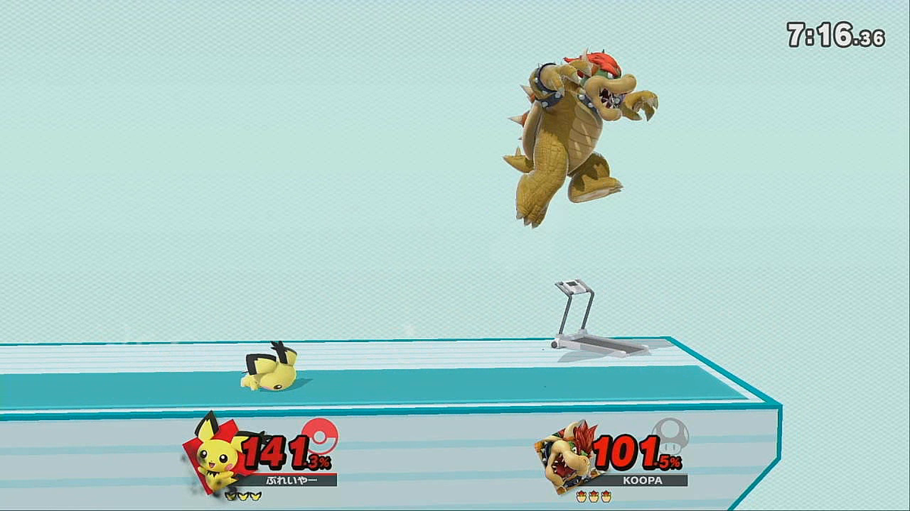

---
# moved from https://aoirint.hatenablog.com/entry/2019/07/21/054224
title: SSBUFrameAnalyzer
date: '2019-07-21T05:42:24+09:00'
draft: false
channel: 技術ノート
category: SSBUFrameAnalyzer
tags:
  - SSBUFrameAnalyzer
  - スマブラSP
  - 画像処理
---
# SSBUFrameAnalyzer

## About

- [GitHub - aoirint/SSBUFrameAnalyzer](https://github.com/aoirint/SSBUFrameAnalyzer)

いまのところ、スマブラSPのスクリーンショットから「ダメージ値」・「おなまえ」を取得できる（ただし2人対戦のみ）。フルで毎フレーム処理できるほどのFPS出ないと思う。

適当なSSで動かした目安FPS（ノートPC）: 2.766284 (0.361496 s)

基本的にターゲットの場所を（座標決め打ちで）切り抜いて処理にかけてる。

## ダメージ値の取得

HOG特徴量使ったk-nnにしたけど、適当に確認して（写真と違ってノイズ入らないし、バリエーションも少ない）問題なさそうだったのでとりあえずTop1しか使ってない。すごい。

（被ダメージ・ふっとびで）エフェクトかかると取れなくなるだろうけど、自動化するなら前フレーム維持/スキップでいいと思って考慮してない。

参照データ数減らせばちょっと速くなるだろうけど、OCRの方が負荷大では（試合中にほぼおなまえ変わらないし、別にいいのか？ 団体戦？）。

## おなまえの取得

Tesseract使ってOCR。たまに精度あやしいけどだいたいOK。すごい。

か→が、ぷ→ふ、みたいに濁点/半濁点に弱そう。

おなまえの長さ上限10文字までいけると思う（ひらがな10文字はためしてOK）。

## TODO

- ファイター数の推定
  - どうすればいいんだ。（自動化して連続的にとるなら）一回推定すればいい気がするから、遅延気にせずHOG系の枠を一通り試行してうまくいった組み合わせを採用？
- 各種bboxの自動算出
  - ファイター種類（キャラクター）の推定
    - HOGでいけるだろうけど、データ集めが面倒
- ストック数の推定
  - ホカホカ（高被ダメージ）のときエフェクトが重なるのがあぶない
- 残タイムの推定
  - タイム∞のとき表示されない例外
  - 背景ころころ変わるので精度出そうと思ったらknnな気がする......

## Example



```shell
{'fighters': {0: {'name': 'ふれいやー', 'damage': 141.3}, 1: {'name': 'KOOPA', 'damage': 101.5}}}
FPS: 2.499149 (0.400136 s)
```

濁点/半濁点は苦手...。プレイヤー→フレイヤーさん。
