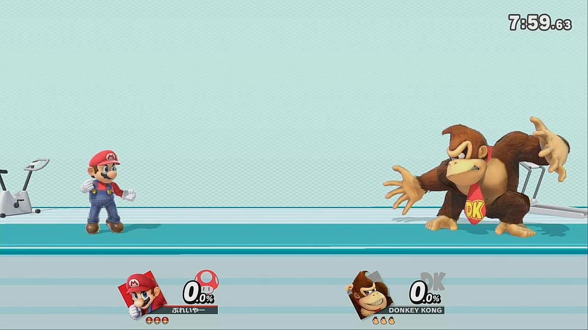
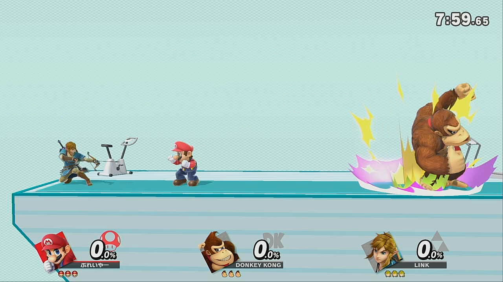
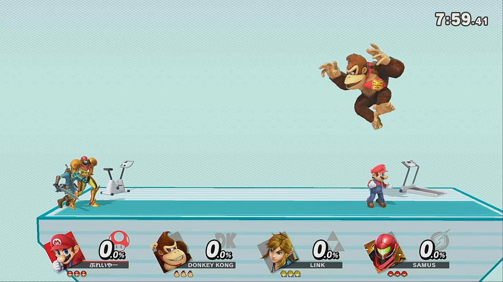

---
# moved from https://aoirint.hatenablog.com/entry/2019/07/21/205320
title: SSBUFrameAnalyzer v2
date: '2019-07-21 20:53:20'
draft: false
channel: 技術ノート
category: スマブラSP
tags:
- スマブラSP
- 画像処理
---
# SSBUFrameAnalyzer v2

## About

[GitHub - aoirint/SSBUFrameAnalyzer](https://github.com/aoirint/SSBUFrameAnalyzer)

いまのところ、スマブラSPのスクリーンショットから「ダメージ値」・「おなまえ」・「キャラ名」を取得できる（ただし2,3,4人対戦のみ）。

「おなまえ」の取得精度は微妙。アルファベットだったら少し精度いいかも？

- [SSBUFrameAnalyzer · えやみぐさ](https://blog.aoirint.com/entry/2019/ssbuframeanalyzer/)

## 「キャラ名」の取得
ダメージ値と同じくHOG特徴量で最近傍（knnに拡張できる）。データには対戦中のキャラ顔画像を使用。

一応（大きく）モデル違うやつ（色変えただけ以外、ex. むらびと、ポケモントレーナー、ルフレ♂♀、クッパJr.など）はデータ用意してるけど、確認はしてない。漏れあるかも。

## Example 1



```shell
['マリオ', 'マリオ', 'マリオ'] [5.536537823295048, 6.301248636752482, 6.390935400999263]
['ドンキーコング', 'ディディーコング', 'ルキナ'] [5.539215799855154, 9.311677857638966, 9.606319879292924]
{'fighters': {0: {'chara_name': 'マリオ', 'name': 'ぷれしいやー', 'damage': 0.0}, 1: {'chara_name': 'ドンキーコング', 'name': 'DONKEY KONG', 'damage': 0.0}}}
FPS: 2.286091 (0.437428 s)
```

## Example 2



```shell
['マリオ', 'マリオ', 'マリオ'] [5.971331723619266, 6.220896989804241, 6.286527104504024]
['ドンキーコング', 'ディディーコング', 'ロボット'] [5.520510947750764, 9.599002436376757, 9.670321221911154]
['リンク', 'ルキナ', 'シュルク'] [5.455176600531569, 8.748479515310487, 8.780689053687928]
{'fighters': {0: {'chara_name': 'マリオ', 'name': 'tbここ', 'damage': 0.0}, 1: {'chara_name': 'ドンキーコング', 'name': 'DONKEY KONG', 'damage': 0.0}, 2: {'chara_name': 'リンク', 'name': '1旧い|', 'damage': 0.0}}}
FPS: 1.381940 (0.723621 s)
```

## Example 3



```shell
['マリオ', 'マリオ', 'マリオ'] [5.5006358082686555, 5.74951932443511, 5.7915505642106995]
['ドンキーコング', 'ディディーコング', 'ルキナ'] [4.692127133850047, 9.475091942436732, 9.545288243557097]
['リンク', 'シュルク', 'ルキナ'] [4.3889363397440455, 8.67419528745303, 8.707431208635597]
['サムス', 'ダークサムス', 'ケン'] [4.181132231378159, 8.547772471042341, 8.683606629158557]
{'fighters': {0: {'chara_name': 'マリオ', 'name': '1に', 'damage': 0.0}, 1: {'chara_name': 'ドンキーコング', 'name': 'IDONKEY KONG', 'damage': 0.0}, 2: {'chara_name': 'リンク', 'name': 'LINK', 'damage': 0.0}, 3: {'chara_name': 'サムス', 'name': 'SAMUS', 'damage': 0.0}}}
FPS: 1.227384 (0.814741 s)
```
