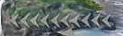

---
# moved from https://aoirint.hatenablog.com/entry/2019/08/05/194314
title: SSBUFrameAnalyzer v3
date: '2019-08-05T19:43:14+09:00'
draft: false
channel: 技術ノート
category: リリースノート
tags:
  - リリースノート
  - SSBUFrameAnalyzer
  - スマブラSP
  - 画像処理
---
# SSBUFrameAnalyzer v3

## History

- [GitHub - aoirint/SSBUFrameAnalyzer](https://github.com/aoirint/SSBUFrameAnalyzer)
- [SSBUFrameAnalyzer · えやみぐさ](https://blog.aoirint.com/entry/2019/ssbuframeanalyzer/)
- [SSBUFrameAnalyzer v2 · えやみぐさ](https://blog.aoirint.com/entry/2019/ssbuframeanalyzer_v2/)

## What's New

- 「ストック」を取得できるようにした（精度イマイチ）
  - 3ストックまで想定（4ストック以上は未実装）
  - 一応団体戦考慮してストックごとにキャラクター推定
  - 精度イマイチな原因かも：背景、ファイター順によってちょっと決め打ち座標がズレてる、画像が小さすぎる→大きく補間してからHOG？
- 勇者（Hero）のデータを追加（v3のdictionary）
  - コマンド出てるときは（顔に被るから）邪魔で難しいと思う...

- [GitHub - aoirint/SSBUFrameAnalyzer at v3](https://github.com/aoirint/SSBUFrameAnalyzer/tree/v3)

## TODO

- ファイター数の推定
- bboxのズレ解消
- bboxの自動算出
- 残タイムの推定
- 画面中のファイター位置の推定
  - 深層学習（YOLO/R-CNN系かセグメンテーション）になりそう、データがない...
- 精度向上
  - normalizeしたり、コントラスト上げたり、周辺ぼかすフィルタ掛けたりしたら精度上がらないかな
- チャージ・残量系キャラ（ルフレ、クラウド、リトル・マック、インクリング、ジョーカー、勇者他？）のチャージ・残量推定
  -      
- ステージの推定（データ...）
