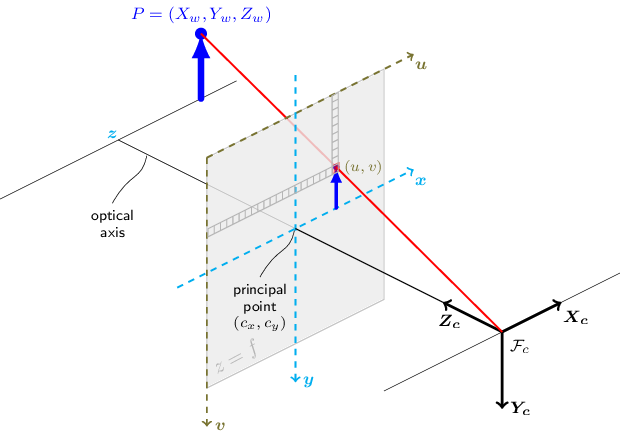

---
# moved from https://aoirint.hatenablog.com/entry/2020/03/21/031621
title: ピンホールカメラモデル
date: '2020-03-21 03:16:21'
draft: false
channel: 技術ノート
category: 画像処理
tags:
  - 画像処理
  - 'Computer Vision'
---
# ピンホールカメラモデル

- [Pinhole camera model - Wikipedia](https://en.wikipedia.org/wiki/Pinhole_camera_model)
- [OpenCV: Camera Calibration and 3D Reconstruction](https://docs.opencv.org/4.2.0/d9/d0c/group__calib3d.html)

3次元空間をカメラで撮影したときの、「3次元空間（実世界）上の点の座標$(x, y, z)$」と「2次元写真平面上の点の座標$(u, v)$」の変換$(u, v) = T(x, y, z)$を考える。

カメラの位置を3次元空間における原点$O$とする。

ここでカメラに固有なパラメータとして、焦点距離$f (> 0)$を導入する。焦点距離は、カメラ（原点$O$）に入射した光が写真として実像を結ぶスクリーン（写真平面）までの距離である。この設定から、3次元空間上で写真平面（スクリーン）は$z = -f$にあるとわかる（写真平面をx-y平面と並行とし、z軸を3次元空間上の奥行きとする）。なお、$f$がより大きいカメラで撮影したとき、同じ距離にある被写体はより大きく写る（凸レンズ）。

（図は[Pinhole camera model - Wikipedia](https://en.wikipedia.org/wiki/Pinhole_camera_model#The_geometry_and_mathematics_of_the_pinhole_camera)から引用。軸X1, X2, X3はx, y, zに、Y1, Y2はu, vに対応）

点P$(x, y, z)$から原点Oを通過し、スクリーン上の点Q$(-u, -v, -f)$に入射する光を考える。なお、実像は光軸を中心に上下左右に反転するため、このとき点Qは写真において座標$(u, v)$にある。

点Pからxz平面上に落とした点P'$(x, 0, z)$、点Qからxz平面上に落とした点Q'$(-u, 0, -f)$を導入する。ここで、三角形POP'と三角形QOQ'は共通の角度を持つ相似な三角形である。この性質から、辺POと辺P'Oの長さの比$x / z$、辺QOと辺Q'Oの長さの比$(-u) / (-f)$は等しい。すなわち、$\frac{x}{z} = \frac{u}{f}$。$u$について整理すると、$u = f \frac{x}{z}$。

（図は[Pinhole camera model - Wikipedia](https://en.wikipedia.org/wiki/Pinhole_camera_model#The_geometry_and_mathematics_of_the_pinhole_camera)から引用。青線がスクリーン上の実像、赤線が実体。計算では図中の$f$を$-f$としている）

同様にyz平面上に落とした点からなる三角形について考えると、$v$について同様の議論が成り立つ。よって、次の座標変換式が得られる。

$$
\left( \begin{array}{c} u \\ v \end{array} \right) = \frac{f}{z} \left( \begin{array}{c} x \\ y \end{array} \right)
$$

なお、今回は写真を実像として考えたが、以下の図のように写真を虚像として捉えると上下左右の反転を起こさずに考えることができる。この場合も得られる変換式は（当然）同じである。

（図は[Detailed Description @ OpenCV: Camera Calibration and 3D Reconstruction](https://docs.opencv.org/4.2.0/d9/d0c/group__calib3d.html#details)から引用。焦点$F_c$を原点とする）
