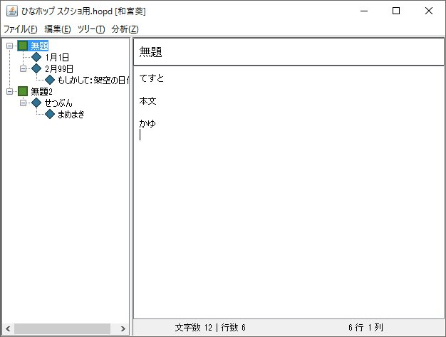
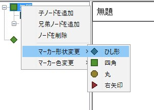
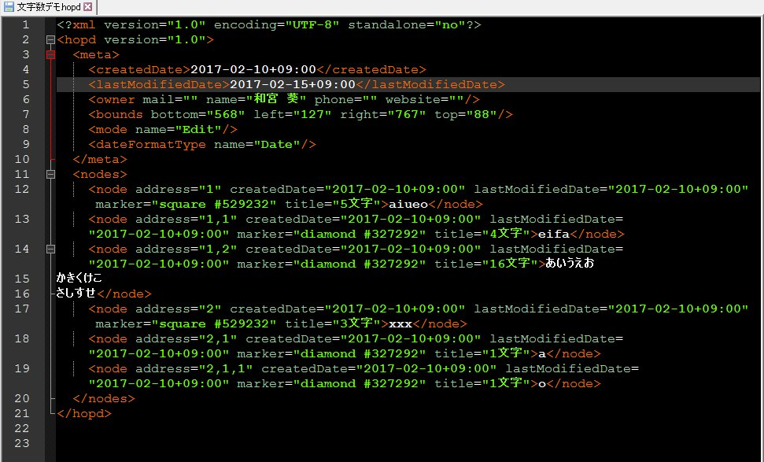
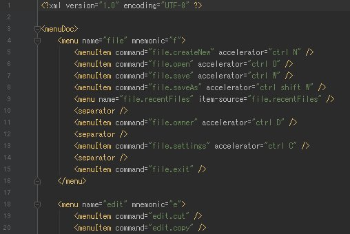
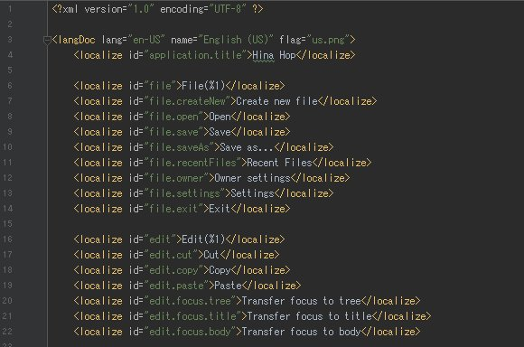

---
# moved from https://aoirint.hatenablog.com/entry/2020/03/24/154739
title: HinaOutlineProcessor（ひなホップ） 2017/01-03
date: '2020-03-24T15:47:39+09:00'
draft: true
channel: 技術ノート
category: Work
tags:
- Work
---
# HinaOutlineProcessor（ひなホップ） 2017/01-03

2017年の頭に開発していたxmlベースの階層型アウトラインプロセッサ。Java Swing製。

- [https://github.com/aoirint/HinaOutlineProcessor](https://github.com/aoirint/HinaOutlineProcessor)

<blockquote class="twitter-tweet">
ひなホップ（Hina Outline Processor）の開発 <a href="https://t.co/2zd5fj5mN1">pic.twitter.com/2zd5fj5mN1</a>
&mdash; kanomiya (@kanomiya) <a href="https://twitter.com/kanomiya/status/836616749252390912?ref_src=twsrc%5Etfw">February 28, 2017</a></blockquote>

UIの仕様はStory Editor（旧）をベースにしている。Story Editorのモダン化とマルチプラットフォーム化ができればいいな、と思っていた。マルチプラットフォームならWebでは、と思われるかもしれないが、ローカルにファイルを置いておきたい気持ち（また、同時編集の沼も存在する）。その後、先行ツールの意外な高機能性の発見や大学進学のストレスなどでモチベが失われ、Minecraft Moddingを再開した。

UI概観。

ドキュメントファイルはこんな感じ。これを作っていた時期に関しては見逃してほしい。

設定ファイル。

<iframe width="560" height="315" src="https://www.youtube.com/embed/WE1oR2c4lQs" title="YouTube video player" frameborder="0" allow="accelerometer; autoplay; clipboard-write; encrypted-media; gyroscope; picture-in-picture" allowfullscreen></iframe>

SQLite BrowserのUIに刺激されて言語変更機能を付けた。
