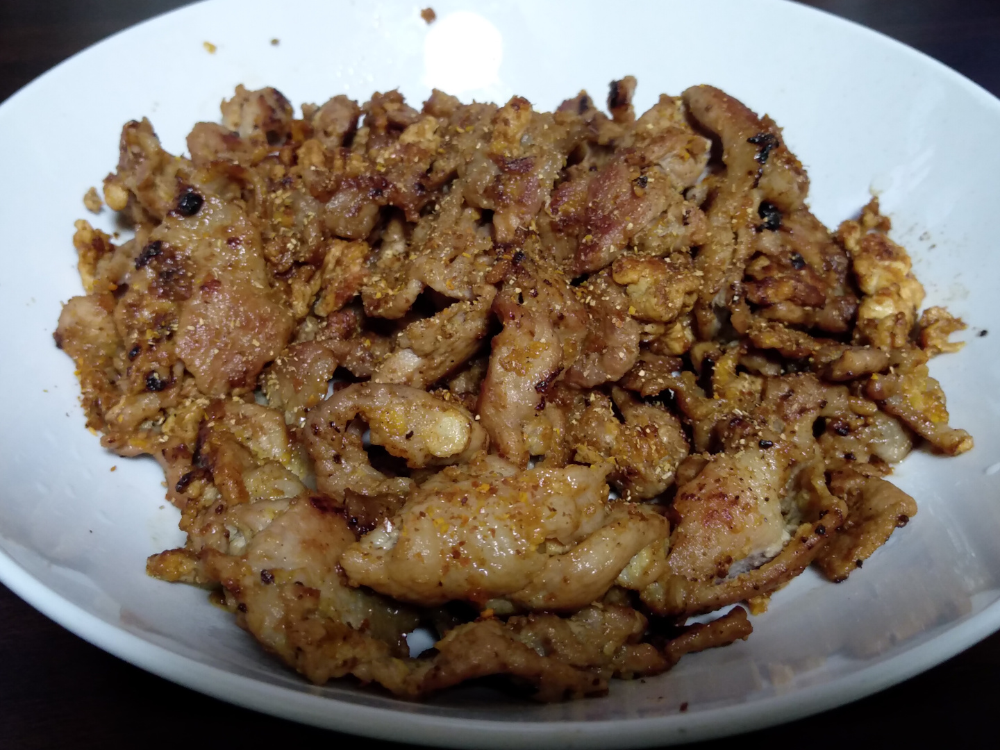

# 2021-11-27

## VOICEVOX

VOICEVOX 0.9.1がリリースされ、つむぎちゃん、リツさんが実装された。

まだ使いこなせていないけれど、つむぎちゃんは、はっきりしたいい声で話してくれる。
リツさんもクールな声で話してくれる。

しかし、WebページとLinux版では、つむぎちゃんの画像がぼやけていた...。
このままでは、わたしの中のイメージが、ぼやけつむぎちゃんになってしまう。
ソフトウェア側の立ち絵がぼやけていなかったのが救いだが。

どうにも、奇数幅の画像を表示しようとするときに起きる問題らしい（Chromeか、画像を扱うライブラリか、グラフィックスドライバか）。
圧縮効率がよくなるといいなと思って、自分の作る画像ではだいたい偶数幅にするようにしていたけれど、謎の問題が起きることがあるのか...。
画像フォーマットの仕様上は奇数幅画像を扱えるのに、なんか残念な感じがある。
Windows版のChromeはなにか対策が組み込まれているのか、はたまた偶然か、再現しなかった。
Electronの方（VOICEVOXソフトウェア）では再現したので、Chromiumが抱える問題かもしれない（Chromeではなんやかんや修正されているとかあるかもしれない）。

- [https://github.com/Hiroshiba/voicevox_resource/pull/1](https://github.com/Hiroshiba/voicevox_resource/pull/1)
- [https://github.com/Hiroshiba/voicevox_blog/pull/6](https://github.com/Hiroshiba/voicevox_blog/pull/6)

修正のため、それぞれPRを用意したけれど、Webページの方は自動縮小版画像が絡んで少しややこしそう。
あと、再現性がよくわからない、おま環対策PRなのも不安要素（ヒホさんの環境では再現しないっぽい）。
一回Issueを作ってからでもよかったけれど、修正策は一応分かっているので...。
もっといい方法があるかもしれないというのは気になるが。

## おためし

<audio src="assets/ぼやけつっむです.mp3" controls></audio>

VOICEVOX:春日部つむぎ, <a href="assets/ぼやけつっむです.vvproj" download>ぼやけつっむです.vvproj</a>（VOICEVOX 0.9.1）

なんか0.9.1時点ではちょっと音割れ気味な感じがあるので、音量を控えめにした方がいいかもしれない（0.50くらい?）。

誰にでも様付けするデルシェア姫（胃世界料理道）のイメージを反映してみたい（ボイロ同士の掛け合い）。

卑屈というわけではなく、活発な女の子だけれど、相手に失礼にならないようにと気をつけるあまり、敬語が抜けない感じ。

デルシェア姫は高貴な生まれだけれど粗野な平民と頻繁に触れ合う機会があったという特殊な経緯があるので、
卑屈に見えないようにするには、そういった背景が必要かもしれない。

いま商用ソフトで持っているのはA.I. VOICEの琴葉姉妹だけなので、VOICEVOXのキャラと合わせて読み上げさせてみる。

> 茜さま

<audio src="assets/茜さま.mp3" controls></audio>

> 葵さま

<audio src="assets/葵さま.mp3" controls></audio>

> めたんさま

<audio src="assets/めたんさま.mp3" controls></audio>

> ずんだもんさま

<audio src="assets/ずんだもんさま.mp3" controls></audio>

VOICEVOX:春日部つむぎ, <a href="assets/春日部つむぎ_キャラさま呼び.vvproj" download>春日部つむぎ_キャラさま呼び.vvproj</a>（VOICEVOX 0.9.1）

声が元気なので、こういうキャラクター性を演じられる感を得ている（公式設定とは無関係に）。

> わああ、めたんさま、それはいかなる御技なのでしょう！

<audio src="assets/わああ、めたんさま、それはいかなる御技なのでしょう.mp3" controls></audio>

VOICEVOX:春日部つむぎ, <a href="assets/春日部つむぎ_わああ、めたんさま、それはいかなる御技なのでしょう.vvproj" download>春日部つむぎ_わああ、めたんさま、それはいかなる御技なのでしょう.vvproj</a>（VOICEVOX 0.9.1）

<audio src="assets/ふふん、つむぎは知っているかしら.mp3" controls></audio>

VOICEVOX:四国めたん, <a href="assets/四国めたん_ふふん、つむぎは知っているかしら.vvproj" download>四国めたん_ふふん、つむぎは知っているかしら.vvproj</a>（VOICEVOX 0.9.1）

ベアトリス（Re:ゼロから始める異世界生活）のアニメCVを聞いたことがないので、これに近いイメージを持っている。

<audio src="assets/四国めたん_特に意味はないのよ？　ほんとよ？.mp3" controls></audio>

VOICEVOX:四国めたん, <a href="assets/四国めたん_特に意味はないのよ？　ほんとよ？.vvproj" download>四国めたん_特に意味はないのよ？　ほんとよ？.vvproj</a>（VOICEVOX 0.9.1）

波音リツはクールな声ゆえに使いどころが難しいかも。

<audio src="assets/波音リツ_使いどころさん！？ まずいですよ！.mp3" controls></audio>

VOICEVOX:波音リツ, <a href="assets/波音リツ_使いどころさん！？ まずいですよ！.vvproj" download>波音リツ_使いどころさん！？ まずいですよ！.vvproj</a>（VOICEVOX 0.9.1）

電車の例はよかった。落ち着いた声?

<audio src="assets/波音リツ_次は、明大前、明大前.mp3" controls></audio>

VOICEVOX:波音リツ, <a href="assets/波音リツ_次は、明大前、明大前.vvproj" download>波音リツ_次は、明大前、明大前.vvproj</a>（VOICEVOX 0.9.1）

## コマンド

```shell
sox input1.wav input2.wav concatenated.wav

ffmpeg -i input.wav -ar 48000 output.mp3
```

---

## ごはん

```
豚肉こまぎれ 200g
中華ペースト
にんにくペースト
塩こしょう

フライパンでいったん火を通す

卵 1個

卵黄と卵白に分ける
卵黄を肉の上に投入し、絡ませながら加熱
卵白を肉の上に投入し、絡ませながら加熱

しょうゆ 少量
砂糖 少量
を入れて加熱

盛り付け後、
山椒
一味唐辛子
```

<details>

</details>
