# 【My new gear...】FunLogy Mobi. 14インチ モバイルモニター

- [https://www.amazon.co.jp/dp/B08NCJMYNT](https://www.amazon.co.jp/dp/B08NCJMYNT)
  - ときどきセール価格になる

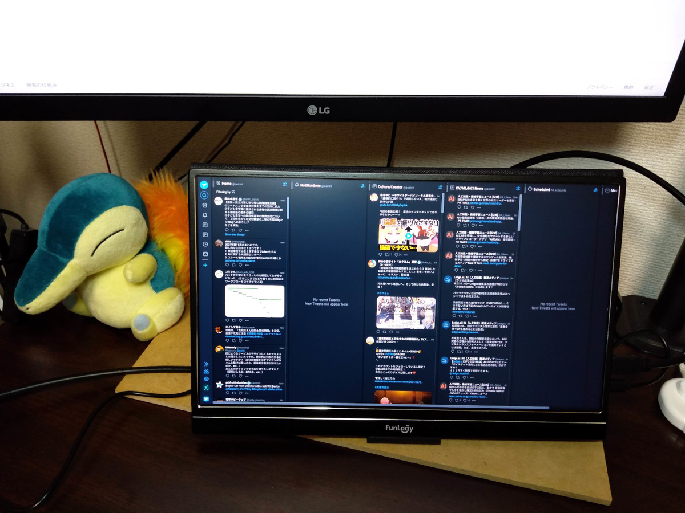

3枚目兼持ち出し用ディスプレイとして購入。
家ではTwitter用、持ち出しではカフェでノートPCを開いて作業するときなどに使いたい。

サイズ感は想定通り（A4紙より長辺が1.5-2cmくらい長い、短辺は同じくらい）、画面品質もよさそう。
応答速度もTweetDeckを見る分には問題なし。

付属スタンドは結構もろそうにみえる（上から技術書を載せたら割れそう）。
また前側のストッパーが低いので少しだけだが外れやすそう（多少手で揺らした程度なら問題なし）。
適当なタブレットスタンドを探してみてもいいかもしれない。
マグネットでくっついている本体カバー（折り返してちゃんと画面側も覆うことができる）もスタンド代わりになるが、
かなり薄いのでカバーがだめになりそう..

給電はUSB 5V 2.4A電源、およびデスクトップPCのUSB 3.0ポートで動作を確認した。
ケーブル長1mのため近くに電源が必要。Type C 1本で接続できれば別電源は不要らしい。
Type C端子のないノートPCなら給電用Type A-Type Cケーブルを空いてるUSB-Aポートに繋げば給電できると思う。
バッテリ消費は激しくなるだろうが..。
Raspberry Pi 4B、USB 5V 3A電源、Raspberry Pi OS Desktopでは、他になにも繋がずにUSB 3.0ポートにつなげた状態では給電できた。
追加で7インチディスプレイのタッチパネル用USBケーブルを繋いだらモバイルモニタ側の表示が点いたり消えたりしたので、
Raspberry Piの場合、給電中は別のUSB機器を使えないかもしれない。

---

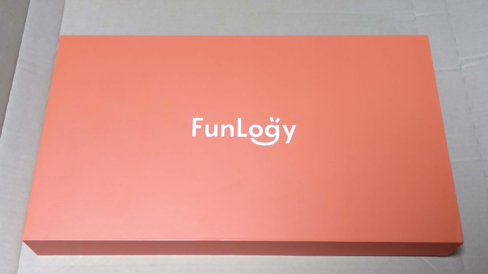
梱包

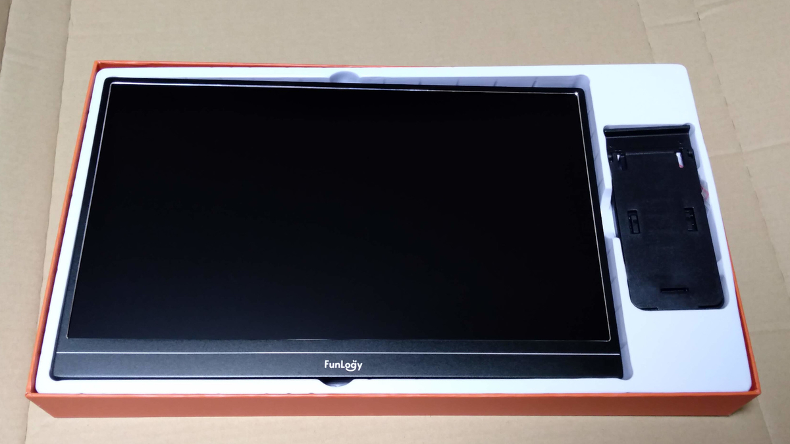
クッション・保護シートを取り外したところ、右は付属スタンド

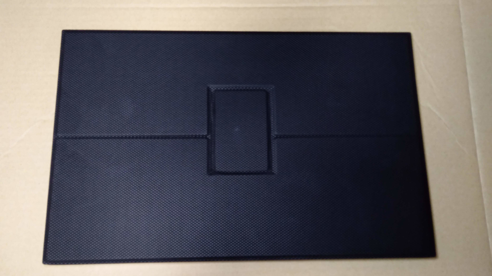
表面（カバーは折り返したときに裏にくる面、内側にディスプレイがある）

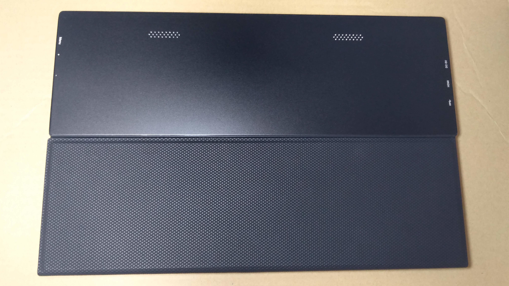
裏面（カバーを折り返したときに内側に隠れる面）

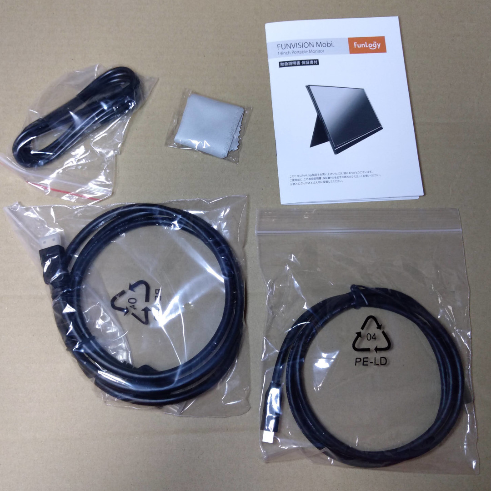
付属品（HDMI-mini HDMIケーブル、Type C-TypeCケーブル、Type A-Type Cケーブル、クロス、説明書）、
付属ケーブルはすべておおむね1m程度の長さ、
HDMI-mini HDMIケーブルは太め

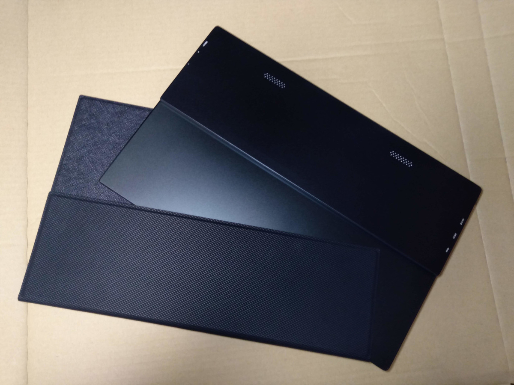
カバーはマグネットで付いている

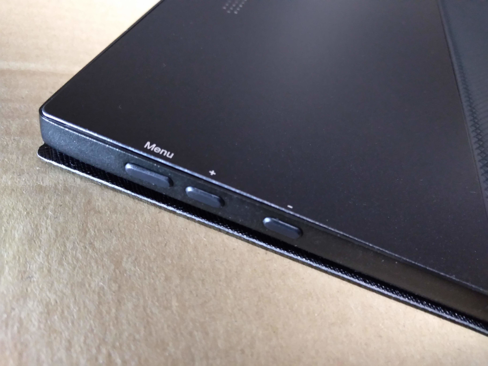
ボタン（表面から見て左側、写真左側が下）

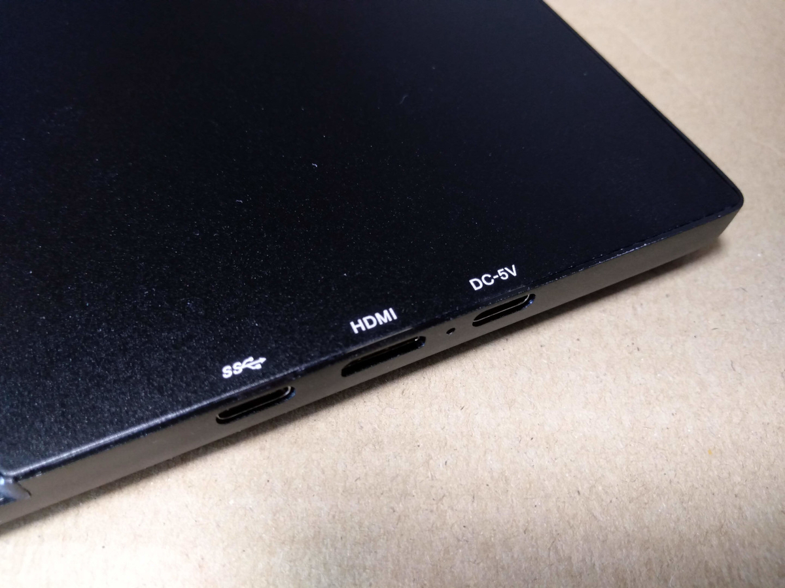
端子（表面から見て右側、写真右側が下）、下から給電用Type C、映像用mini HDMI（2本接続用）、映像/給電用Type C（1本接続用）

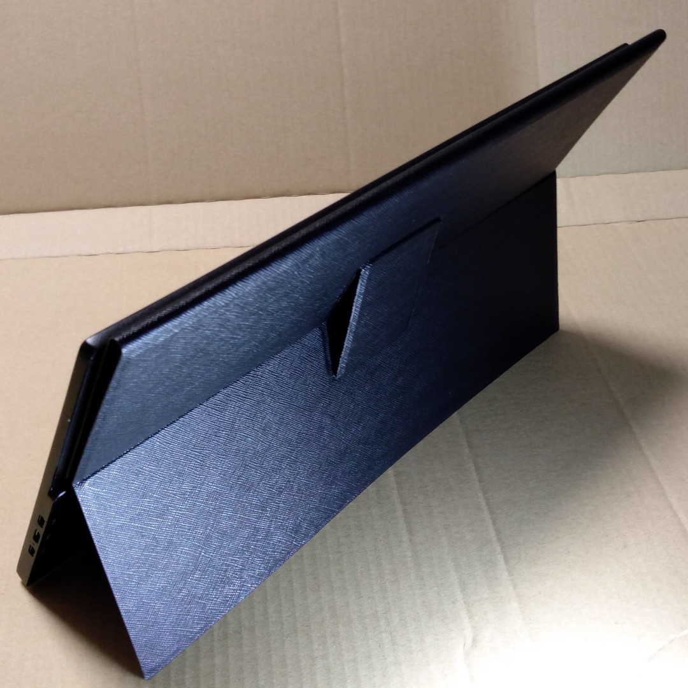
カバーを使って立てた様子

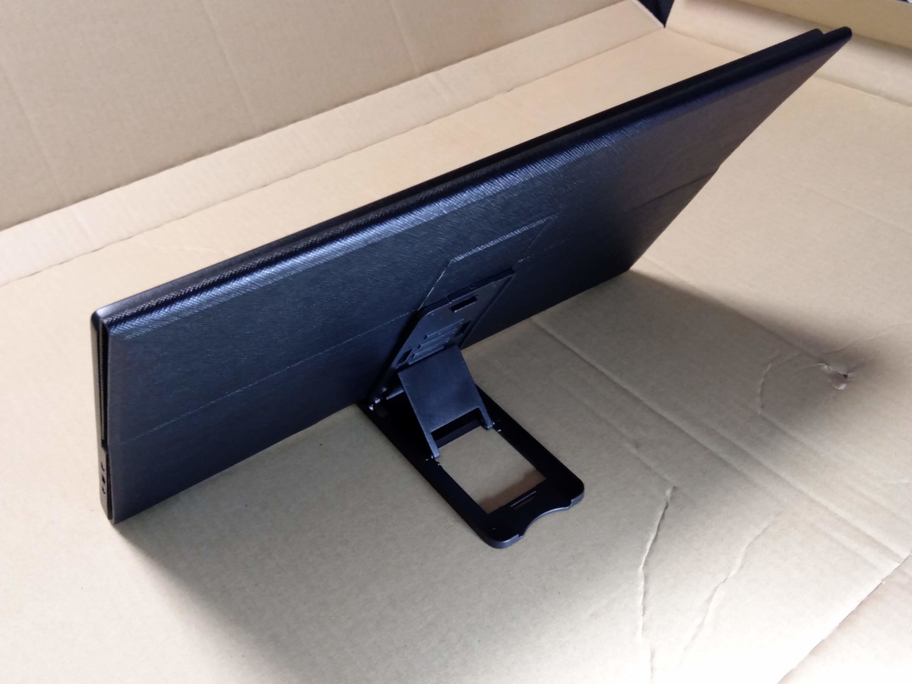
付属スタンドを使って立てた様子

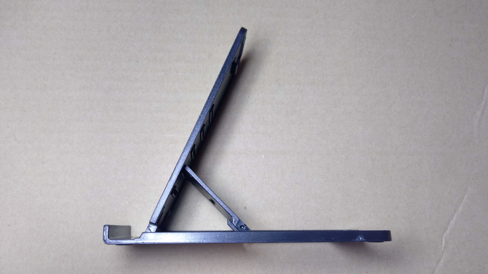
付属スタンド（5段のうち下から2段目）

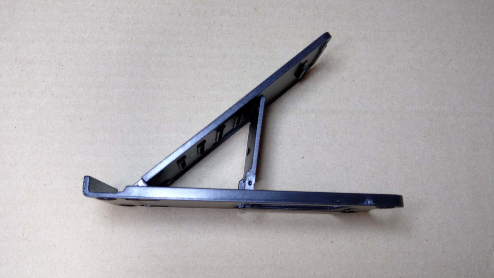
付属スタンド（5段のうち下から5段目）

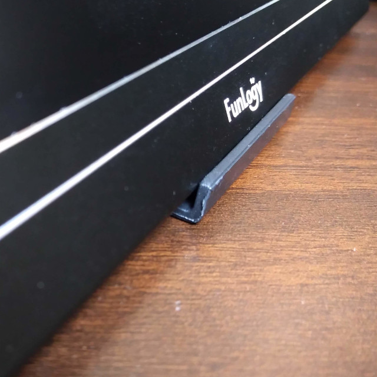
付属スタンドで立てたときの根元（5段のうち下から2段目）

設置の様子（スタンドは5段のうち下から2段目、明るさ100%に設定、USB 5V 2.4A電源、HDMI mini接続）

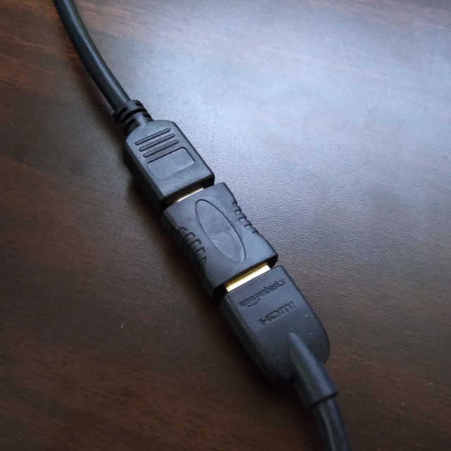
HDMIケーブルの接続（取り外しやすくするため、HDMI延長アダプタを使用）
