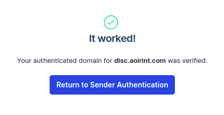
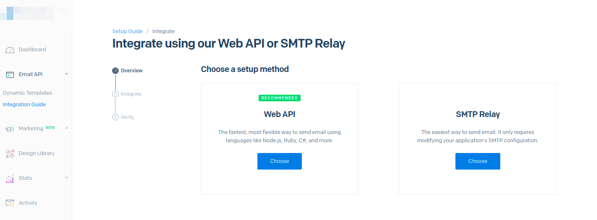

# SendGrid

## 背景
Discourseをセットアップしようとしていたところ、いくつかのEmailプロバイダが紹介されていた。

- <https://github.com/discourse/discourse/blob/4e0a43f2117ac83bcf7e0f9bed65370f6c4c15bb/docs/INSTALL-email.md>
    - [Mailgun](https://www.mailgun.com/)
    - [SendGrid](https://sendgrid.com/)
    - [Mailjet](https://www.mailjet.com/pricing)
    - [Elastic Email](https://elasticemail.com/)

Discourseはセットアップにメールサーバが要求される。以前のMastodonのセットアップでは、Gmailとアプリパスワードを使った簡易セットアップを使ったが、経験積みとセキュリティ上の懸念から、今回はメールサーバを用意することにした。

名前を聞いたことのあるSendGridを使う。業務上の利用を想定しているようだが、個人による利用として続行する。スケールする商用サービスでの利用ではないが、利用経験は技術選定の上で大事だと思う。その分、Abuseしないように考えなければならないが。

## Freeプラン
- <https://sendgrid.com/pricing/>

1日に100メールまではFreeプランが使用できる。自分しか使わない、またはごくごく小規模な利用では十分だろう。

## 登録
- <https://sendgrid.com/>

`Start For Free`から登録する。

細かい登録の過程は省略する。

## ドメインの認証

ダッシュボードを開く。

- <https://app.sendgrid.com/>

- <https://app.sendgrid.com/settings/sender_auth/domain/create>

ドメインプロバイダ（DNSホスト）の選択を求められる。
お名前.comはリストになかったので、`Other Host (Not Listed)`を選択し続行する。
あまり意味はないだろうが、Which DNS Hostにプロバイダ名を書いておく。

ドメイン名を入力する。

DNSサーバに登録すべき認証用のレコードが表示される（DNSサーバにクエリを送れば誰でも確認できるので公開情報）。

ドメインプロバイダ/DNSサーバでDNSレコードを設定する。
設定が反映されるまでしばらく待つ。

ドメインが認証された。
これでSendGridを使って、このドメインからのメールを送信できるようになった。

## APIキーの発行（送信テスト）

- <https://app.sendgrid.com/guide/integrate>

Web APIを選択する。

プログラミング言語/利用プログラムを選択する。チュートリアルの出し分けをするだけで、ここでの選択に特に意味はないと思われる（チュートリアルなしでAPIキーを発行もできる： <https://app.sendgrid.com/settings/api_keys>）。

とりあえずcURLでテストすることにして、APIキーを発行する。

下のcurlコマンドの送信JSONデータを編集する。
toを自分のメールアドレス、fromを認証したドメインのメールアドレスに変える。
特にfromのメールアカウントを作成する必要はなく、
`hoge@example.com`のように適当なアカウント名をつけたアドレスを使えばよい。

コマンドを適当な端末で実行し、メールが届けば成功。

SendGrid上でも送信成功を確認できる。
