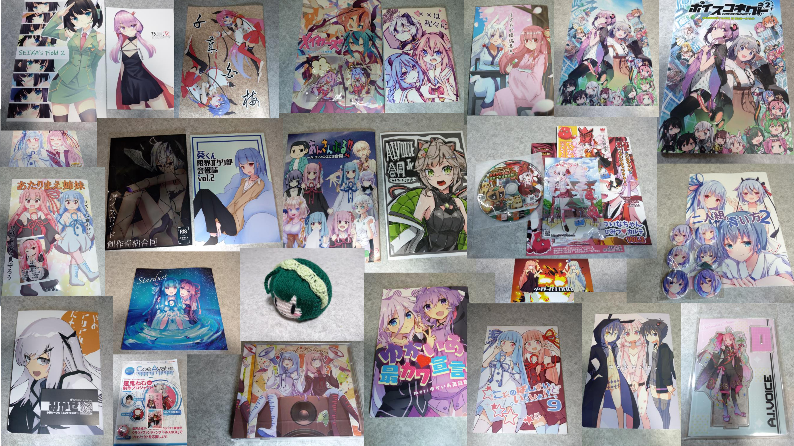
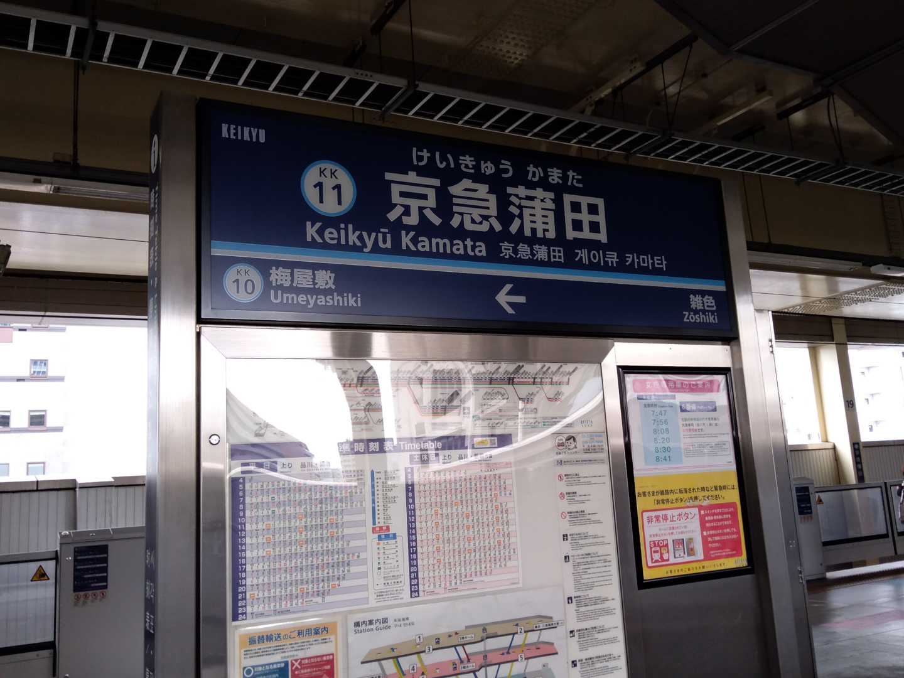

# ボイスコネクト2に一般参加してきました

- <https://twitter.com/voiceconnect_ad>

<blockquote class="twitter-tweet">
ボイスコネクト2戦利品！ <a href="https://t.co/0zPuofINNu">pic.twitter.com/0zPuofINNu</a>
&mdash; aoirint🎐 (@aoirint) <a href="?ref_src=twsrc%5Etfw">March 27, 2022</a></blockquote>

## 参加動機

- ボイスロイド文化圏（ソフトウェアトーク文化圏）にこの1年で浸かった
    - VOICEROID劇場・遊劇場・実況、ふにんがす、なのそん、VOICEROID投稿者の生放送、etc
- Seiren Voiceのデモ体験をしたかった
    - VOICEVOXでお世話になっているヒホさん（ヒロシバさん）の数年来の努力＆お仕事の成果を応援したい
    - この文化圏に来た端緒はDeNAの声変換技術の七声ニーナの影響が少なからずある＝声変換技術への興味がある
- 何かしらの同人即売会に参加してみたかった
    - いわゆる同人即売会（コミケとか）に一度も参加したことがなかった（似ているものといえば、技術系の展示会くらい？）

## 感想

今回の参加体験はとてもよかった。次回もよい体験ができることを願っています。

同じものが好きな人が集まる場所って面白いなと思った。

ヒホさんに挨拶できてよかった（まあ忙しかっただろうし、覚えてないと思うけど…）。
即売会は、同好の士の社交の場という認識を強くした。まあわたしはこの文化圏に対して独自の成果物がある身ではなくファン目線なので、若干肩身が狭いけれど...。

### 収集管理について

Todoistのカンバンを使って、ブースの種類別にセクションを分類して、各サークルをサークル名とブース名でタスク化、各頒布物の名前と価格をサブタスク化して管理した。
途中、移動中に間違って操作されて状態管理がめちゃくちゃになったので、なにもわからなくなったけど・・・。

### 頒布物の収集について

SeirenVoiceのデモがなければ参加していなかったと思うし、参加登録も（SeirenVoice発表後の）前日～前々日くらいで2部構成の2部参加だったので、頒布物の収集ははじめからある意味で手に入ったらラッキーくらいのおまけだった。（もちろん好きなので、ほしいことはほしいが）。

まあ次回があるかもしれんし、ワンチャン委託が出る可能性もあるし、Twitterでイラストあげてくれるし...。

これからも手に入ったらラッキーくらいで考えていくといいと思った。

### 釣銭について
現金は参加の前から、これは交換チケットだな、と思った。

頒布物は、釣銭問題（お釣りが発生すると大量の釣銭の準備が必要または釣銭が不足する）を起こさないためにキリのいい頒布価格になっていることが多いという事前知識はあった。

今回の一般参加にあたっては、100ポイントと500ポイントと1000ポイントの交換チケットがそれぞれ何枚ある、として、各サークルでの収集物と、その支払いに使う券の種類を事前に決めた上で、一切お釣りが発生しないように計画を立てていた。

サークルを巡る順番を厳密に決めること、確実に目的の頒布物を収集すること、は困難で、特に初参加かつ準備時間が限られた自分には不可能だった。釣銭の概念を捨てることで、それぞれが支払いに影響しないという利点を得られるという考えがあった。

釣銭については、前夜にTwitterでサークル参加者の発言を検索して何かお願いが出ていないかも探した。それは特に見つけられなかったが、この頃は銀行の硬貨取り扱い手数料が上がる傾向になっていることを踏まえて、釣銭を発生させないこと、の次に、紙幣が使えるなら紙幣を使うことを計画していた。

まあ最悪、何忘れても参加証（スマートフォン）と財布だけは持って行けよ、というようなツイートもあったので、余裕があるときの気遣いくらいで、気楽に構えることができた。

結果的には、終盤に計画外の追加収集をしたことで1度釣銭を発生させる取引をしたけれど、終盤であったこと、集まりやすいだろう500円の釣銭であったこと、頒布物的に紙幣の支払いが発生するサークルであったこと、から大丈夫だろうと判断した。

### 小銭の用意について

今回はたまたま500円玉と100円玉の持ち合わせが多くて、1000円札で引き出して、分散させつつちょっと崩すくらいで済ませられた。

まあ銀行で両替するのが安牌だけれど、平日昼間しか取り扱いしていなかったし、手数料結構するしで難しい。

普段の取引は95%くらいキャッシュレスなので、まともに現金を使ったのはすごく久しぶりな気がした。

現金を使うのは、キャッシュレス非対応の自動販売機とか、ごはん屋さんとか、コンビニプリンターくらいか。

次回の参加に備えて、すこしずつ集めていくのが一番いい気がした。

### サークルチェック

### ソフトウェアトーク動画投稿祭応援しまくる祭（ニコニコ公式生放送）
