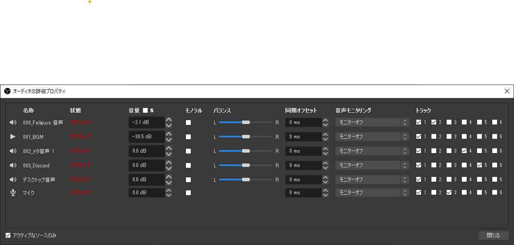

# 複数の音声ストリームを持つ動画ファイルを簡単に編集する方法がほしい

OBSには、音声を複数のストリームに分けて録画する機能がある。



Shotcutを使って編集しているのだけれど、複数の音声ストリームをうまく扱えないでいる。
1つの動画アイテムに対して、全部のストリームを混ぜるか、もしくは1つの音声ストリームを選ぶことはできるけれど、音声ストリームを選択して混ぜることができない。
動画アイテムを複製すればできるはずだけれど、そういう想定なのかな・・・？

ffmpegは、mapオプションを使って複数のストリームを持つ動画ファイルを扱うことができる。

そこでffmpegを使って、音声なしの動画ファイルと、各音声ストリームを別々に取り出した音声ファイルに分割するのを試してみた。

以下のようなシェルスクリプトを作った（映像：NVENC H.264、音声aacのmkvファイルを想定）。

```shell
#!/bin/bash

INPUT=$(realpath "$1")
#OUTDIR=$(realpath -- "$(dirname "${INPUT}")")
OUTDIR=.
FILENAME=$(basename -- "${INPUT}")
EXTENSION="${FILENAME#*.}"
BASENAME="${FILENAME%%.*}"

mkdir -p "${OUTDIR}"
ffmpeg -i "${INPUT}" \
    -map 0:v:0 -vcodec copy "${OUTDIR}/${BASENAME}_video.${EXTENSION}" \
    -map 0:a:1 -vn -acodec copy "${OUTDIR}/${BASENAME}_app.m4a" \
    -map 0:a:2 -vn -acodec copy "${OUTDIR}/${BASENAME}_mic.m4a" \
    -map 0:a:3 -vn -acodec copy "${OUTDIR}/${BASENAME}_meta1.m4a" \
    -map 0:a:4 -vn -acodec copy "${OUTDIR}/${BASENAME}_vc.m4a"
```

```shell
splitAudioTrack myrecording.mkv
```

これを使って、Fallguysの60fps, 15分程度の録画ファイルを分割してみたけれど、ストレージが録画用のHDDなのが悪いのか、変換に実時間程度かかってしまうことがあった
（ffmpegは、Windows 10上でWindowsバイナリとWSL2上のLinuxバイナリをそれぞれ試したけれど、速度はほぼ同じだった）。

場合によって、4倍速から7倍速で分割できることもある。Windows Defenderとか、Search Indexerとかが悪さをしているのかもしれない。
FPSも、実際に60フレームを正確に掴めてはいないと思うし、容量や処理時間と映像品質の間でコスパが悪いと思うので、30fpsに落とすと速くなりそうではある。

1度分割すれば好きな動画編集ソフト上で、各ファイルをトラック（レイヤー）に配置して好きにできるけれど、分割に時間がかかるのはうれしくない...。
分割ファイルができることによって容量が2倍になるのもうれしくない...。

特に、手早くクリップを作りたいときに不便だと思った。

クリップ用に、ffmpegをwrapしたGUIアプリケーションがほしいけれど、（マルチプラットフォーム向けに）動画編集用のGUIを作る最適解がよくわからない...。
