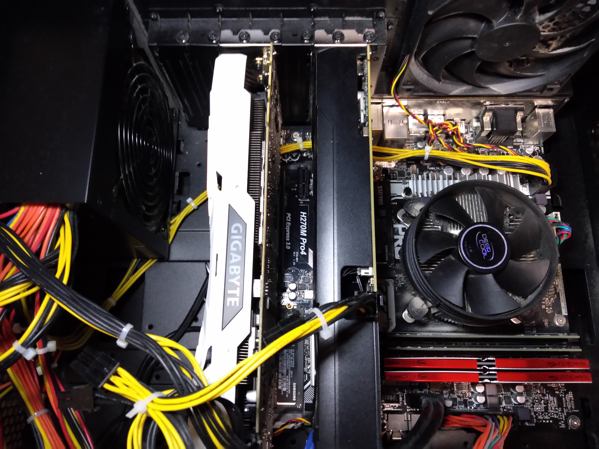
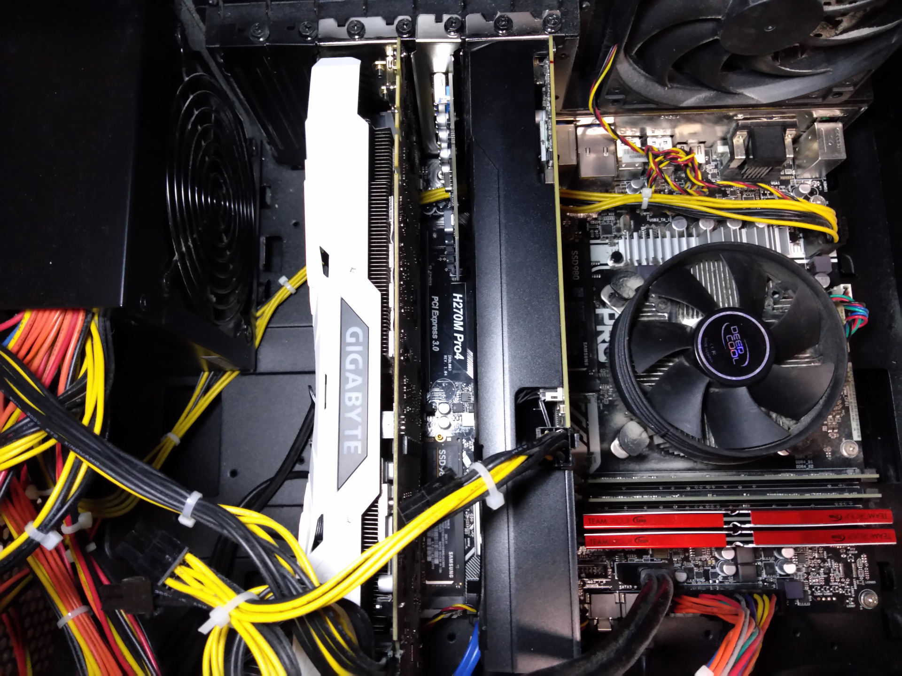
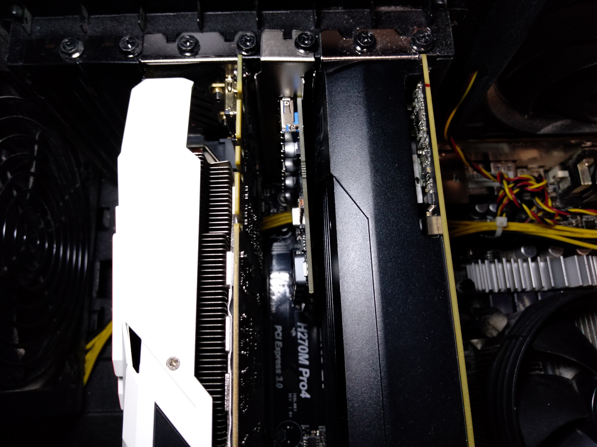
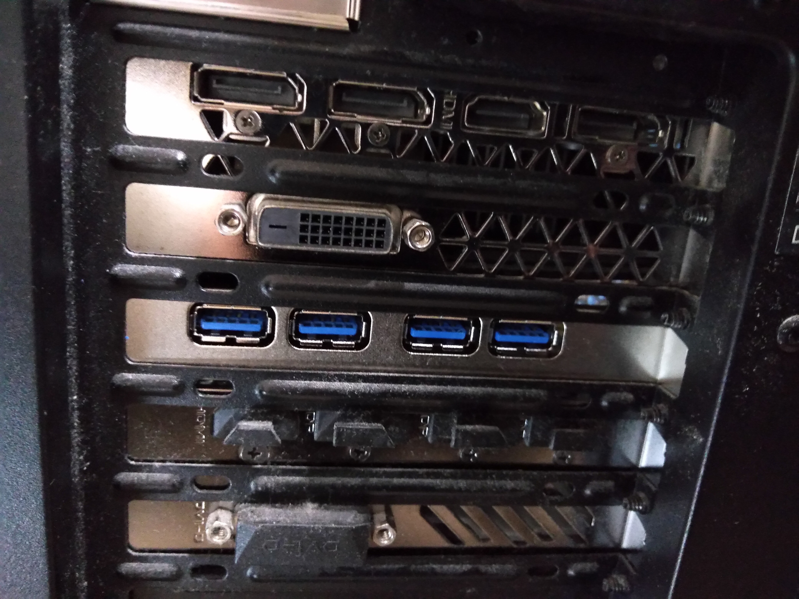

# PCIe USB 3.0増設ボード（ELUTENG）を追加した

- <https://www.amazon.co.jp/dp/B07CWP8DBT>

10月末に1568円で買っていた。

これまで、USB 3.0の増設用途には、2018年6月に1755円で購入した外部電源付きのUSBハブを使っていた。

- <https://www.amazon.co.jp/dp/B00KKJJCXC>

PC裏は電源やUSBケーブル・オーディオケーブル・LANケーブルなどで配線地獄になってしまう。
また、様々な電源を必要とする機器によって、電源コンセントが埋まってしまう。

主に以下のような目的で、タイトルにある改修をすることにした。

- ケーブルの数を減らす
- 電源コンセントを空ける
- 空いているPCIeポートを活用する
- 拡張ボード挿してみたい

## 作業写真

### 追加前のマザーボード全体

### 追加後のマザーボード全体

### 設置箇所 拡大

### ケース背面

