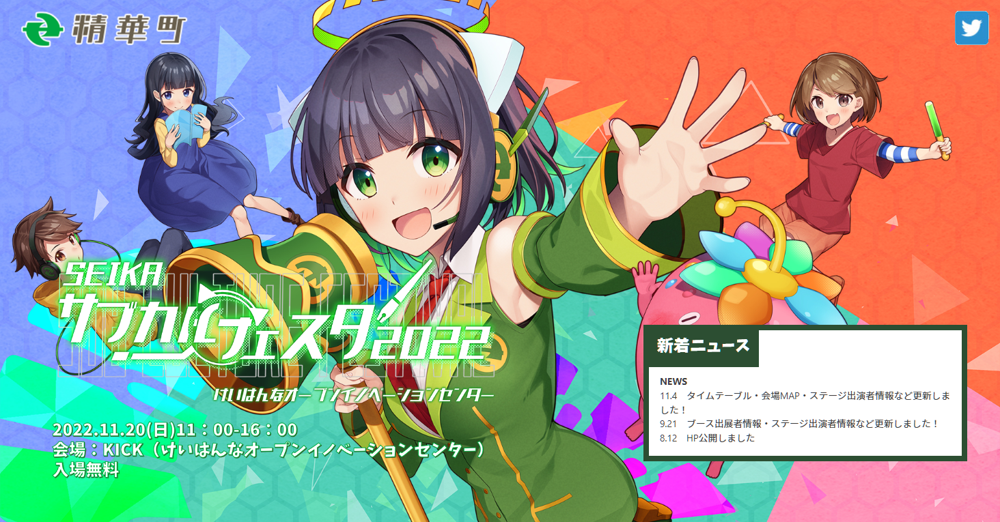

# SEIKAサブカルフェスタ2022 ニコニコ公式生放送を見た

## SEIKAサブカルフェスタ2022

SEIKAサブカルフェスタ2022は、2022年11月20日（日）に京都府精華町で行われたイベント。
精華町の広報キャラクター京町セイカをはじめ、鬼っ子ハンターついなちゃんなど様々なキャラクターや、キャラクター・精華町に関連する企業・自治体などが出展した。

同時開催イベントとして、音声合成オンリーイベント 声音の宴（同人誌即売会）、せいか祭り2022（地域のお祭り）、せいかビジネスフェア2022（地域の商工イベント）などが行われた。

- SEIKAサブカルフェスタ2022 公式サイト: <https://subculfesta.kyomachi-seika.jp/>
- SEIKAサブカルフェスタ2022 運営Twitter: <https://twitter.com/seika_subcul>
- 声音の宴 公式サイト: <https://kowa-uta.com/>
- 声音の宴 運営Twitter: <https://twitter.com/kowa_uta>
- けいはんなオープンイノベーションセンター 公式サイト: <http://kick.kyoto/>

（SEIKAサブカルフェスタ2022 公式サイト より）

## セイカフェス2022

セイカフェス2022は、2022年7月1日から10日までニコニコ動画で行われた、京町セイカに関する動画・歌・イラストの投稿祭。
京町セイカを愛してやまない動画クリエイターのシルシラ氏が企画した非公式ファンイベントで、200作品以上が投稿された。

- ニコニコ動画 タグ「セイカフェス2022」がついた作品一覧: <https://www.nicovideo.jp/tag/%E3%82%BB%E3%82%A4%E3%82%AB%E3%83%95%E3%82%A7%E3%82%B92022>
- ニコニコ静画 タグ「セイカフェス2022」がついた作品一覧: <https://seiga.nicovideo.jp/tag/%E3%82%BB%E3%82%A4%E3%82%AB%E3%83%95%E3%82%A7%E3%82%B92022>

ファンイベントなのだが、協賛に精華町、ニコニコ代表 くりた 氏、AHS 社（京町セイカの音声合成ソフトを販売している会社）、立花理香 氏（京町セイカの声優）が名を連ねた。また、キャラクターデザインコースを持つ、京都市にある京都精華大学も協賛した。

要件を満たす参加作品はコンテストに応募することができ、動画部門・歌部門・イラスト部門のグランプリ・準グランプリ、および特別賞としてニコニコ賞、AHS賞、京町セイカ賞、京都精華大学賞、精華町賞、運営特別賞が贈られた。

当時のレギュレーションおよびコンテスト結果は、以下の動画および説明文から確認できる。

- <https://www.nicovideo.jp/watch/sm40423993>

### コンテスト結果

- 動画部門 グランプリ
  - 【セイカフェス2022】セイカさんとずんだもん　～刺繍糸でセイカさんを作ってみたのだ～ (iyokan 氏): <https://www.nicovideo.jp/watch/sm40724521>
- 動画部門 準グランプリ
  - セイカとずんだもんが納税ダンスを踊るだけ【ソフトウェアトーク劇場】 (Sinα 氏): <https://www.nicovideo.jp/watch/sm40746930>
- 歌部門 グランプリ
  - 【京町セイカAI】はじまるよ！セイカフェス【Synthesizer V 】 (とりごや 氏): <https://www.nicovideo.jp/watch/sm40591127>
- 歌部門 準グランプリ
  - 【京町セイカ】妄想税【カバー】 (ハチナナ 氏): <https://www.nicovideo.jp/watch/sm40591127>
- イラスト部門 グランプリ
  - セイカフェス2022 (雅京士郎 氏): <https://seiga.nicovideo.jp/seiga/im10992277>
- イラスト部門 準グランプリ
  - ふるさと納税は京都府精華町へ！ (イトウ 氏): <https://seiga.nicovideo.jp/seiga/im10992272>
- ニコニコ賞
  - 【おいでよ！セイカの広報活動】誕生日だけどセイカさんが広報活動を頑張るようです (牛くん 氏): <https://www.nicovideo.jp/watch/sm40703862>
- AHS賞
  - オリジナル曲「Laßt zahle die Heimatortsteuer an die Stadt Seika! (ふるさと納税は精華町へ！)」 Synthesizer V 京町セイカ (Dharma 氏): <https://www.nicovideo.jp/watch/sm40732502>
- 京町セイカ賞
  - 【京町セイカAI】フルサト・ノウゼイ【Synthesizer V 】 (とりごや 氏): <https://www.nicovideo.jp/watch/sm40654065>
- 京都精華大学賞
  - ふるさと納税は京都府精華町へ (moiky 氏): <https://seiga.nicovideo.jp/seiga/im10991572>
- 精華町賞
  - せいか音頭　ユーロビートVer (すいめい 氏): <https://www.nicovideo.jp/watch/sm40703690>
- 運営特別賞
  - 【SynthV #京町セイカ オリジナル曲】21世紀の日記から私の名前が出てきた【 #セイカフェス2022 】 (コレフヂタケシ 氏): <https://www.nicovideo.jp/watch/sm40644877>
  - 【京町セイカ】星明【オリジナル曲】 (SIGM@TURE 氏): <https://www.nicovideo.jp/watch/sm40742805>
  - 【セイカフェス2022】「京町セイカ」人形 作ってみた (ウッドダイスP 氏): <https://www.nicovideo.jp/watch/sm40747246>
  - いちごメイドのセイカさん (はよせな 氏): <https://seiga.nicovideo.jp/seiga/im10991689>

## ニコニコ公式生放送: 百花繚乱と栗田は見た！精華町は実在した！SEIKAサブカルフェスタ2022

百花繚乱と栗田は見た！精華町は実在した！SEIKAサブカルフェスタ2022は、SEIKAサブカルフェスタ2022の会場内ステージで行われたトークショー。ニコニコ生放送で公式番組として同時中継された。タイムシフトは以下から視聴できる（公式番組のため無期限視聴可）。

- <https://live.nicovideo.jp/watch/lv338423389>

出演者（敬称略）

- 百花繚乱（MC）
- 栗田しげたか（ニコニコ運営代表）
- 立花理香（京町セイカの声優）
- シルシラ（セイカフェス2022企画）
- 尾形友秀（株式会社AHS）
- 辻田幸広（京都精華大学）

振り返りとして、セイカフェス2022の受賞作品紹介が行われた。

- セイカフェス2022の概要: <https://live.nicovideo.jp/watch/lv338423389#48:36>
- セイカフェス2022の各部門グランプリ・準グランプリ: <https://live.nicovideo.jp/watch/lv338423389#57:05>
- セイカフェス2022の特別賞: <https://live.nicovideo.jp/watch/lv338423389#1:23:53>

また、とりごや 氏のオリジナル楽曲 フルサト・ノウゼイ について、精華町がオリジナル振付（振付: 香瑠鼓 氏）を発表した。

- 実写: <https://www.nicovideo.jp/watch/so41382183>
- 京町セイカ: <https://www.nicovideo.jp/watch/so41384172>

## VOICEPEAK

VOICEPEAKは、AHS社が販売する音声合成ソフトウェア（Windows、macOS、Linux対応）。
Dreamtonics社が開発した音声合成エンジンSyllaflowを搭載。
キャラクターのいない音声合成ソフトウェアとして、「商用可能 6ナレーターセット」を2022年3月11日に発売する形で始まった。

- プレスリリース: <https://www.ah-soft.com/press/voice/> ([PR TIMES](https://prtimes.jp/main/html/rd/p/000000015.000060783.html))

事例としては、2022年10月に京都市広報キャラクター「京乃つかさ」のキャラクターボイスとして採用された。

- プレスリリース: <https://www.ah-soft.com/press/voice/20221017.html> ([PR TIMES](https://prtimes.jp/main/html/rd/p/000000024.000060783.html))

2022年11月17日、キャラクターシリーズの展開が発表された。
東北ずん子、彩澄しゅお、彩澄りりせ、フリモメンの4種が2022年12月15日に発売予定。
東北ずん子には、VOICEPEAK ずんだもん（単体販売なし）が付属する。
東北ずん子、彩澄しゅお、彩澄りりせには、VOICEPEAK フリモメン（単体販売と同等）が付属する。
また、京町セイカのVOICEPEAK化クラウドファンディングの実施が案内された。

- プレスリリース: <https://www.ah-soft.com/press/voice/20221117.html> ([PR TIMES](https://prtimes.jp/main/html/rd/p/000000025.000060783.html))
- AHS公式生放送第186回 (2022-11-17 放送): <https://www.youtube.com/watch?v=CSSah9cGuog>
  - 発表当日の公式生放送で、東北ずん子の声優 佐藤聡美 氏や、東北ずん子プロジェクトを運営するSSS合同会社 小田恭央 氏が出演した。

## 京町セイカRebootプロジェクト

京町セイカRebootプロジェクトは、2022年11月17日に精華町が開始した京町セイカに関するクラウドファンディング（実施期間: 2022年11月17日～12月21日）。

- クラウドファンディングページ: <https://greenfunding.jp/lab/projects/6727/>
- 京町セイカ 公式Twitter クラウドファンディング告知ツイート: <https://twitter.com/kyomachi_seika/status/1593167307425009664>
- 京町セイカ 公式ニコニコチャンネル クラウドファンディング告知動画: <https://www.nicovideo.jp/watch/so41373736>

以下の4つの公約がある。

- 京町セイカのVOICEPEAK化
- キャラクターコスチューム（コスプレ衣装）の制作
- 3Dモデルの制作
- 精華町のふるさと納税返礼品となるオリジナルグッズの制作

2022年11月17日放送のAHS公式生放送でもクラウドファンディングの実施が案内された。

- AHS公式生放送第186回 (2022-11-17 放送): <https://www.youtube.com/watch?v=CSSah9cGuog>
  - ニュースコーナー 京町セイカ関連: <https://youtu.be/CSSah9cGuog?t=1244>
    - SEIKAサブカルフェスタ2022への参加告知
    - 京町セイカ VOICEPEAK化 クラウドファンディング開始告知
  - <https://youtu.be/CSSah9cGuog?t=5798>
