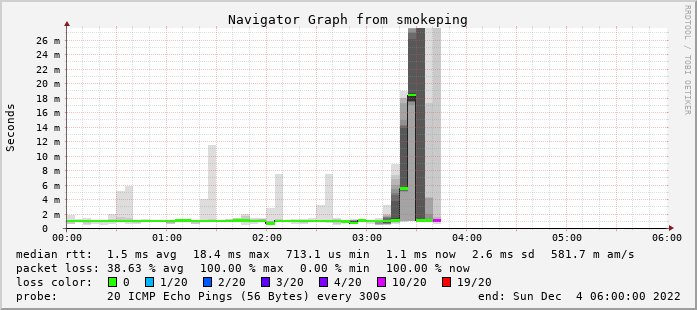

# 2022-12-04から弊サービスの一部で発生していた障害について

原因は、2022-12-04 03:40頃に発生したと推測される、自宅サーバのWAN側IPアドレスの変更によるものと判断されました。以下の画像は、2022-12-04 00:00から06:00における、SmokePingによるNATループバックPingの監視記録です。

2022-12-06 15:00頃、DNSサーバのレコード設定を更新し、TTLにより10分程度で解消する見込みです。

障害の感知は、Better Uptimeの死活監視および、外部セキュアDNSサーバによる名前解決の結果発生した、NATループバック接続の失敗によって行われました。

今回の障害では、48時間以上外部向けのサービスが停止していました。
自動での死活監視があったにもかかわらず、対応に遅れがあったと判断されます。
遅れの原因は、上位回線またはルータの安定性およびサーバの安定性が低く、短時間の接続不良が毎日のように発生していたため、ルータの再起動や上位回線での対応によって問題が自然に解消されることを待機したためと判断されます。
