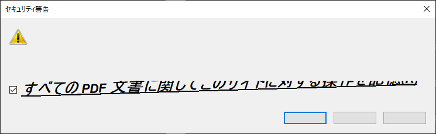
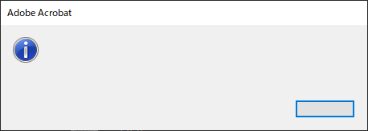
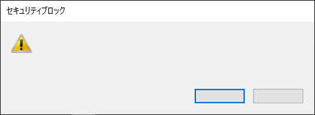
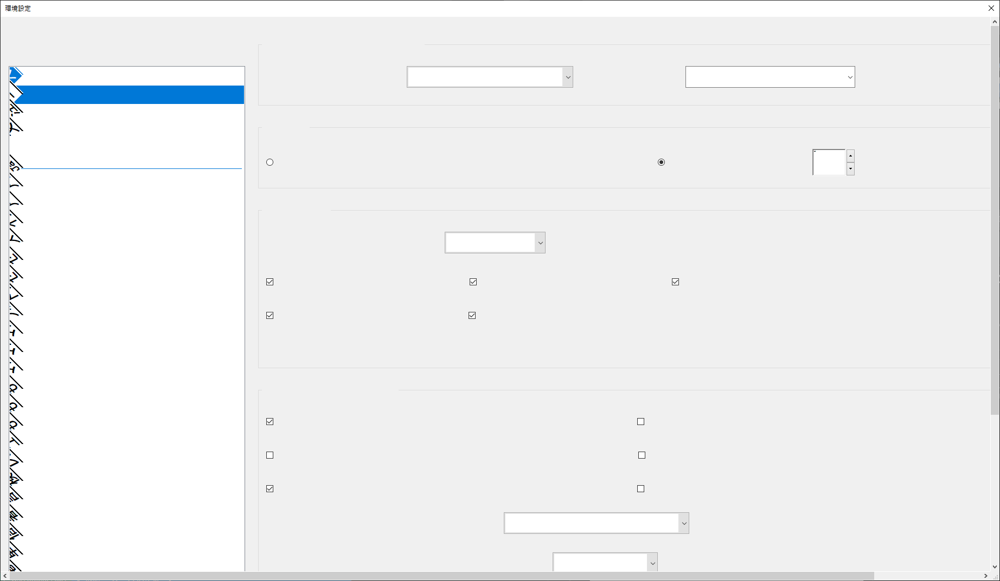
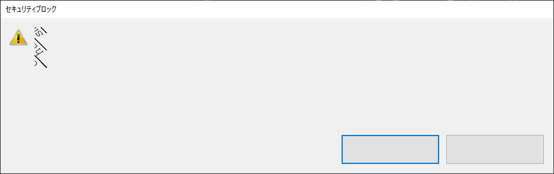
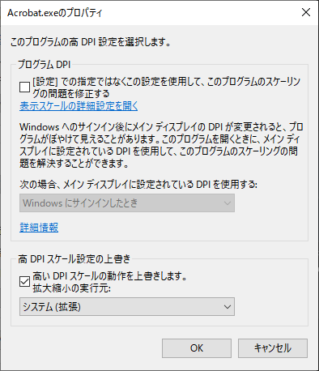
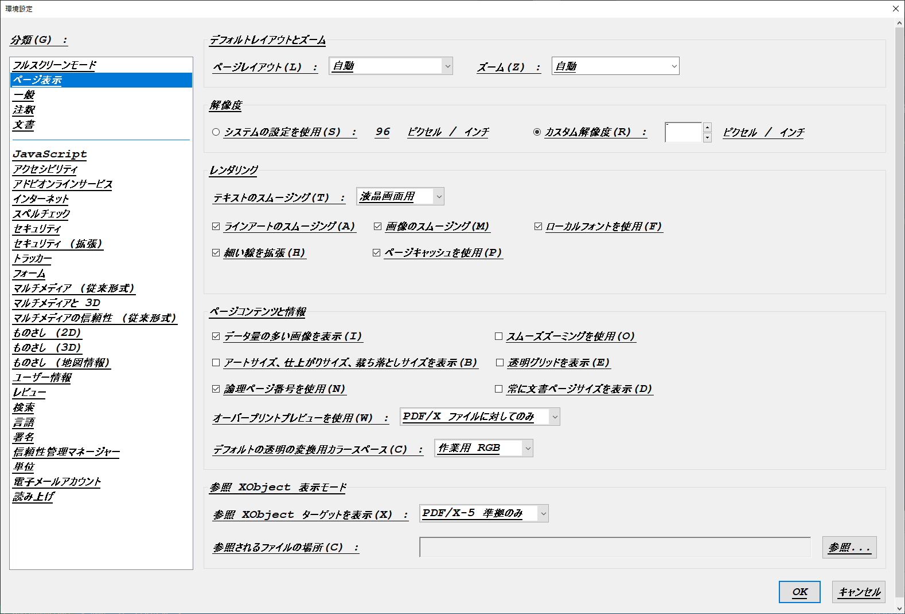
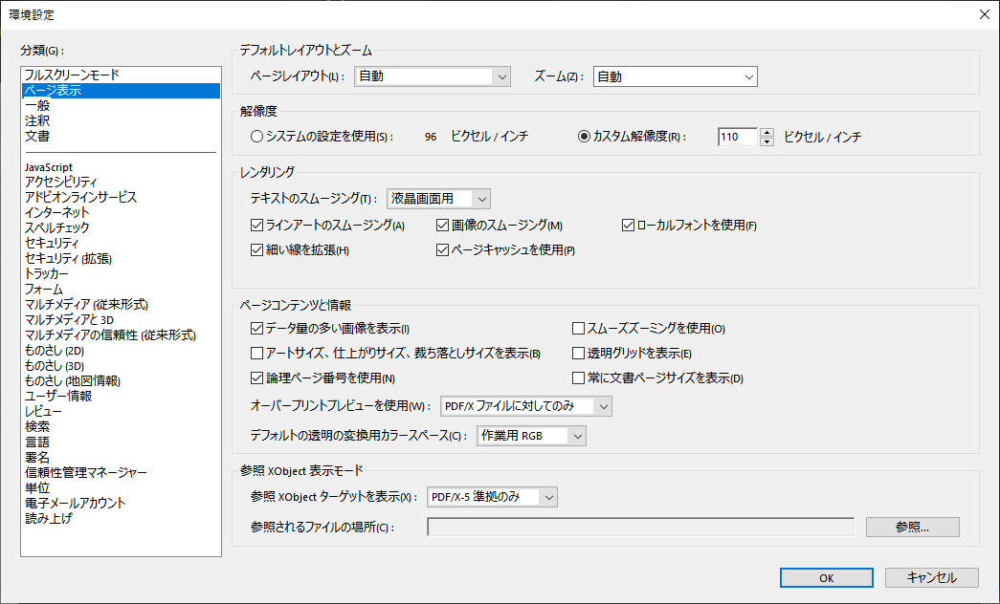
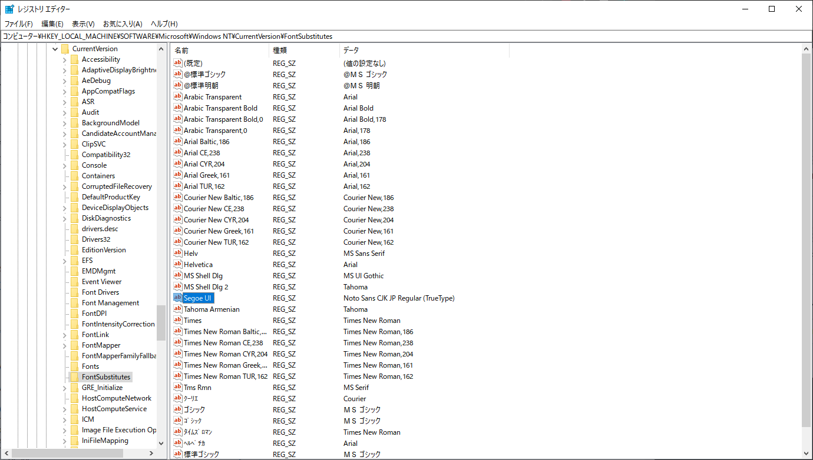

# Adobe Acrobat ReaderのUIが正しく描画されない・印刷しようとするとクラッシュする（Windows 10 21H2）

特定のWindows 10 21H2環境で、Adobe Acrobat ReaderのUIが正しく描画されなかったり、PDFを印刷したりするとクラッシュする症状に悩まされていた。

- [https://twitter.com/aoirint/status/1579530951029579776](https://twitter.com/aoirint/status/1579530951029579776)

## 症状
### 一部のテキスト（太字？）が右上に傾いて表示される



### 一部のテキスト（ボタンのラベル？）が表示されない





### 一部のテキストが135度左回転して表示される



### ボタンのサイズが本来より大きくなる



### 印刷UIを開くとクラッシュする

メニューから印刷を選んで印刷UIを開くとクラッシュする。

クラッシュレポート送信ダイアログも表示されない。

### ほとんどのテキストが太字・下線付きで表示される

高DPI設定を変更すると、表示されなかった一部のテキストを表示できることがあるが、太字・下線付きで表示される。

#### 高DPI設定（Acrobat.exeのプロパティ＞互換性＞高DPI設定の変更）



#### おかしい表示



#### 正しい表示（解決後のスクリーンショット）




## 自分の環境での原因・解決

原因は、Windowsのデフォルトフォントを変更していたことだった。

Windowsのデフォルトフォントは、（おそらくこういった不具合を防ぐため）通常の設定UIでは変更することができない。
レジストリを書き換えることで、フォント名に対応するフォントを変更することができる。
このとき、標準的にWindowsのUIフォントとして使われるSegoe UIフォントで描画する、という指定がされているUI上のテキストを、別のフォントを使って描画するように設定することで、デフォルトフォント（システムフォント）を変更する方法がある。

- デフォルトフォントの変更方法を指南する記事: [https://techcult.com/change-default-system-font-in-windows-10/](https://techcult.com/change-default-system-font-in-windows-10/)



Acrobat Readerを正常に動作させるには、Segoe UIとして描画されるフォントが、正しくSegoe UIフォントである必要があるらしい。

- クラッシュの原因についてSegoe UIフォントの正常性との関係を指摘するコメント: [https://community.adobe.com/t5/acrobat-reader-discussions/acrobat-reader-quit-unexpectedly/m-p/11139813#M66281](https://community.adobe.com/t5/acrobat-reader-discussions/acrobat-reader-quit-unexpectedly/m-p/11139813#M66281)

上のデフォルトフォントの変更方法についての記事を参照し、復元用regファイルを作成・実行、Windowsを再起動することで、Acrobat Readerを正常に動作させることができるようになった。

### recover.reg （TechCultより）

```reg
Windows Registry Editor Version 5.00

[HKEY_LOCAL_MACHINE\SOFTWARE\Microsoft\Windows NT\CurrentVersion\Fonts]
"Segoe UI (TrueType)"="segoeui.ttf"
"Segoe UI Black (TrueType)"="seguibl.ttf"
"Segoe UI Black Italic (TrueType)"="seguibli.ttf"
"Segoe UI Bold (TrueType)"="segoeuib.ttf"
"Segoe UI Bold Italic (TrueType)"="segoeuiz.ttf"
"Segoe UI Emoji (TrueType)"="seguiemj.ttf"
"Segoe UI Historic (TrueType)"="seguihis.ttf"
"Segoe UI Italic (TrueType)"="segoeuii.ttf"
"Segoe UI Light (TrueType)"="segoeuil.ttf"
"Segoe UI Light Italic (TrueType)"="seguili.ttf"
"Segoe UI Semibold (TrueType)"="seguisb.ttf"
"Segoe UI Semibold Italic (TrueType)"="seguisbi.ttf"
"Segoe UI Semilight (TrueType)"="segoeuisl.ttf"
"Segoe UI Semilight Italic (TrueType)"="seguisli.ttf"
"Segoe UI Symbol (TrueType)"="seguisym.ttf"
"Segoe MDL2 Assets (TrueType)"="segmdl2.ttf"
"Segoe Print (TrueType)"="segoepr.ttf"
"Segoe Print Bold (TrueType)"="segoeprb.ttf"
"Segoe Script (TrueType)"="segoesc.ttf"
"Segoe Script Bold (TrueType)"="segoescb.ttf"

[HKEY_LOCAL_MACHINE\SOFTWARE\Microsoft\Windows NT\CurrentVersion\FontSubstitutes]

"Segoe UI"=-
```
