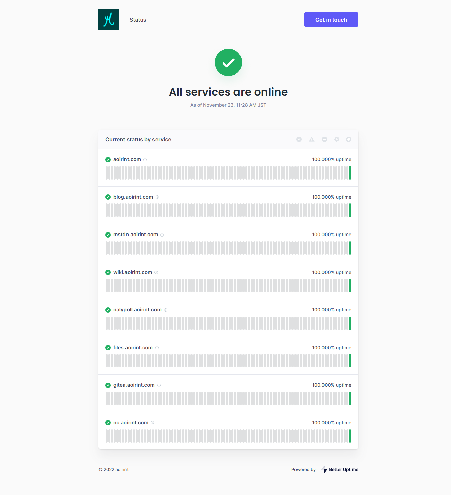

# 死活監視サービスBetter Uptimeを導入した

aoirint.com関連サービスにBetter Uptimeを導入し、死活監視情報の提供を開始しました。

登録時に電話番号が必要なのがネックだけれど、URLを入力して、オプションでカスタムドメインを使うためにDNSにCNAMEレコードを追加したくらいで、結構簡単に使い始められた。

プランは以下を参照。URL 10個まで無料で監視させられる（3分間隔）。

- [https://betterstack.com/better-uptime/pricing](https://betterstack.com/better-uptime/pricing)

カスタムドメインのステータスページ。

- [https://status.aoirint.com](https://status.aoirint.com)

