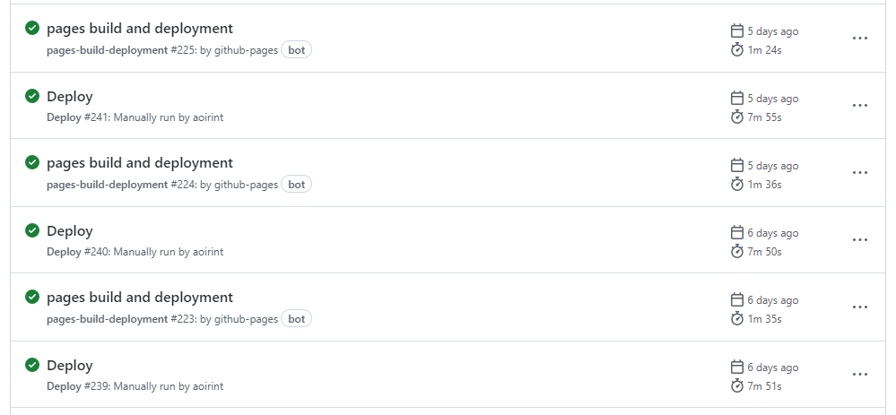
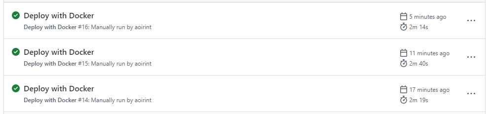
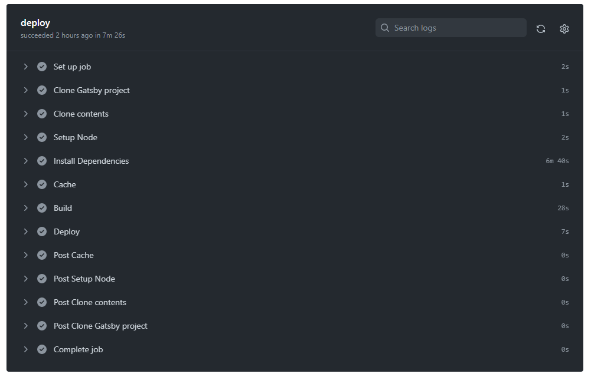

# このブログ「えやみぐさ」のデプロイをDocker化して高速化した

SSGの悩み事: ビルド時間

## デプロイ時間

旧デプロイシステムでは、npmやGatsbyのキャッシュが効いていて9分半程度だった。

新デプロイシステムでは、2分半程度になった。

## やったこと

- GatsbyプロジェクトをDockerイメージ化
- GitHub Pagesのデプロイ元をgh-pagesブランチからGitHub Actionsに変更
    - <https://github.blog/changelog/2022-07-27-github-pages-custom-github-actions-workflows-beta/>
    - <https://docs.github.com/en/pages/getting-started-with-github-pages/configuring-a-publishing-source-for-your-github-pages-site#publishing-with-a-custom-github-actions-workflow>

## GatsbyプロジェクトをDockerイメージ化

- シンプルに`node:14`ベースで`npm ci`したイメージを作っただけ
- `gosu`を使って一般ユーザで実行
- 依存関係のバイナリビルドなどのインストール時処理が事前に済ませられる
    - Node.jsの一部パッケージはインストール時にバイナリビルドするものがおそらくある
    - Pythonにもインストール時にC/C++コンパイラやCMakeを要求するパッケージがある、ただしローカル環境に対応するwheelが用意されていない場合
      - [r9r9/pyopenjtalk](https://github.com/r9y9/pyopenjtalk)
      - たぶんNumPyとかOpenCVとか
      - 新しすぎるPython本体バージョン・armなど特殊な環境だと、wheelが用意されていなくてローカルビルドになることも（それでも開発者がビルドできるように整えてくれていると使える）

- npmパッケージのインストール時処理時間は支配的だった
    - 本質的なGatsbyプロジェクトのビルド処理が30秒程度
    - 依存関係のインストール時処理は6分半から7分程度
- ソースコードの代わりに各環境向けのビルド済みバイナリを提供することでインストールが簡便・高速になるなどの利点を受けられる仕組み（プロプライエタリ？ 知らない子ですね...）
    - apt, PPA
    - Python wheel
- 単純化すると「ビルド時間をストレージ容量で代替する」

## GitHub Pagesのデプロイ元をgh-pagesブランチからGitHub Actionsに変更

- 2022年7月にベータリリースされたGitHubの機能
    - <https://github.blog/changelog/2022-07-27-github-pages-custom-github-actions-workflows-beta/>
- `gh-pages`ブランチの更新には、[peaceiris/actions-gh-pages@v3](https://github.com/peaceiris/actions-gh-pages/tree/v3)を使っていた
    - たぶんかなり有名で、自分でも布教している
- 2021年12月から、`gh-pages`ブランチにpushすると、`pages-build-deployment`というWorkflowが実行され、GitHub Pagesのデプロイ処理が見えるようになった
    - <https://github.blog/changelog/2021-12-16-github-pages-using-github-actions-for-builds-and-deployments-for-public-repositories/>
    - <https://github.blog/2022-08-10-github-pages-now-uses-actions-by-default/>

