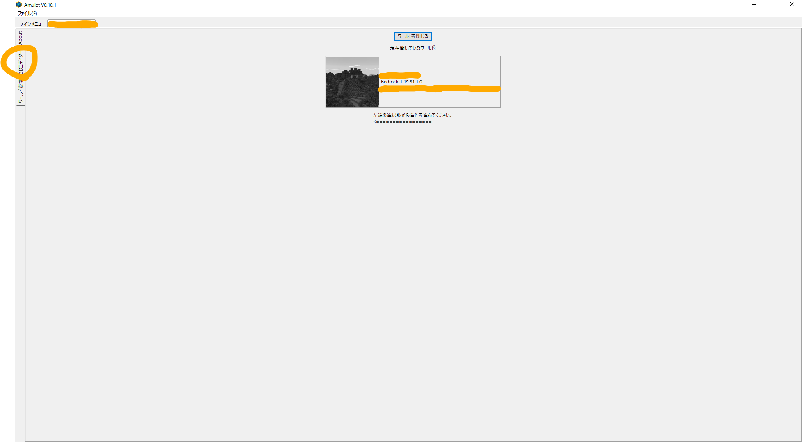

# Minecraft ワールドをBedrock版とJava版の間で変換するWebアプリ「Chunker」

友達数人が参加するBedrock版サーバーを運用していたが、
PCでゲームを遊ぶ割合が増えたことでJava版に移行することになったので、
既存のBedrock版ワールドを変換できないか調査することにした。

## 環境

- Chunker 1.17.4
- Amulet Editor v0.10.1
- Minecraft Java版クライアント 1.19.2
- Minecraft Java版サーバー 1.19.2
- Minecrarft Bedrock版サーバー 1.19.31.01

## Chunker

- <https://chunker.app/>
- <https://apexminecrafthosting.com/convert-bedrock-to-java/>
- <https://learn.microsoft.com/ja-jp/minecraft/creator/documents/chunkeroverview>
    - さまざまなMinecraftのサードパーティーツールを紹介する記事の1つ
    - <https://learn.microsoft.com/ja-jp/minecraft/creator/documents/commonlyusedtools>

ワールドデータをアップロードすると、異なるプラットフォーム・バージョン向けに変換してくれるWebアプリ。

右下のベルボタンから確認できる更新履歴を見る限り、少なくとも2020年5月にはChunker 1.4.1が存在していたようだ。

Hive GamesというMinecraft公式パートナー（Minecraftのマーケットプレイスに出品できる契約をMicrosoftと結んでいるクリエイターのこと）が開発していて、内部ツールを公開したもののようだった。

- <https://twitter.com/theHiveMC>

> Born as an internal tool

- <https://hivegames.io/>

> As part of an exclusive licensing deal with Microsoft

という記述があるが、Chunkerのために別途契約を結んでいるのか、公式パートナーのことを指すのかは読み取れなかった。

2022年5月にリリースを伝える記事がいくつか見られ、TwitterでMinecraftの開発者の1人 David ([@CornerHardMC](https://twitter.com/CornerHardMC))氏が言及していたりする。
公式ツールだとする記事があるが、ソースは見つけられなかった。
個人的には、あくまで非公式ツールだと思っている。

- <https://twitter.com/CornerHardMC/status/1527766756453822464>
- <https://foxynotail.com/minecraft-news/29/minecraft-releases-official-world-converter-and-pruning-tool/>
- <https://www.reddit.com/r/Minecraft/comments/uv5p4c/minecraft_official_chunker_a_map_editor_and/>

## 軽量なワールドを変換してみた

十数日遊んだくらいの、35MB程度のBedrock版ワールドがあったので、ChunkerでJava版に変換してみた。

見た目には、ハーフブロックが一部消えたり入れ替わったりしていそうなくらいで、
いくらか手を入れれば遊べそうだった。

チェストの中身は見た目にはおそらくそのままだが、
プレイヤーはBedrock版とは異なるIDでログインすることになるので、インベントリの中身を直接移動させることはできないと思われる。内部的にインベントリのデータを残しているかは調査していないので不明。

## ワールドのサイズ制限

Chunkerにアップロードできるワールドのサイズ制限はおそらく500MB（記事執筆時点）。

- <https://www.reddit.com/r/Minecraft/comments/y0tngi/chunker_maximum_world_size_for_converting_from/>

手元に733MBある本命のBedrock版ワールドがあり、これをアップロードしようとしたところ、サイズ制限のバリデーションに引っかかった（ディレクトリ・zipと2方式のアップロードボタンがあるが、どちらも同じ）。

ワールドサイズを減らすため、不要なチャンクを削除してみることにした。

## Amulet Editorによるチャンク削除

- <https://www.amuletmc.com/>
- <https://github.com/Amulet-Team/Amulet-Map-Editor>

ワールドを読み込んだあと、Ctrl+Aでワールド全体を選択する。

左の選択範囲フォームからXZを編集して、適当なサイズにする。
適当に試したところ、以下のようなサイズになったので、-5000～+5000を切り取ることにした。

- 20000x20000（-10000～+10000）: 660MB
- 12000x12000（-6000～+6000）: 530MB
- 10000x10000（-5000～+5000）: 480MB

フォームの数字をキーボードで編集するときは、フォームからマウスを外さないようにする。
右の3D表示にマウスカーソルが乗ると、入力欄から選択が外れてしまう。

下の「Chunk」ボタンを押す。

「選択範囲外のチャンクを削除」ボタンを押す。

出てくるモーダルで、現在のチャンクデータを読み込んでUndo可能にするか聞かれるが、
Noを選ぶとUndoできないが高速に作業を進められる。
Yesを選ぶと、Undoポイントの作成に数分以上かかることがある。

右上の保存ボタンを押す。
保存完了の時点ではワールドサイズは減っていないので注意。

ワールドを閉じる。
この操作が完了すると、ワールドサイズが変化する。

10000x10000（-5000～+5000）を切り取ったことで、zip圧縮状態で473MBにすることができた（上のチャンク削除前サイズは圧縮前だが、圧縮時は725MBだった）。

500MBを下回ったことで、Chunkerを使って変換することができた。

こちらのワールドでは、地図や旗が壊れてしまっていた。
軽量ワールドの方では地図を変換できていたようだったので、Amuletを挟んだ影響かもしれないが、
地図の縮尺・複製の違いや、ワールドサイズが大きいことなど、他にも原因が考えられる。

また、すべてのエンティティが消えてしまっているようだったので、村人なども引き継げなさそうだった。
これもChunker単体では不明。

テスト用のワールドを作って検証してみたら、改めて記事を更新したい。
