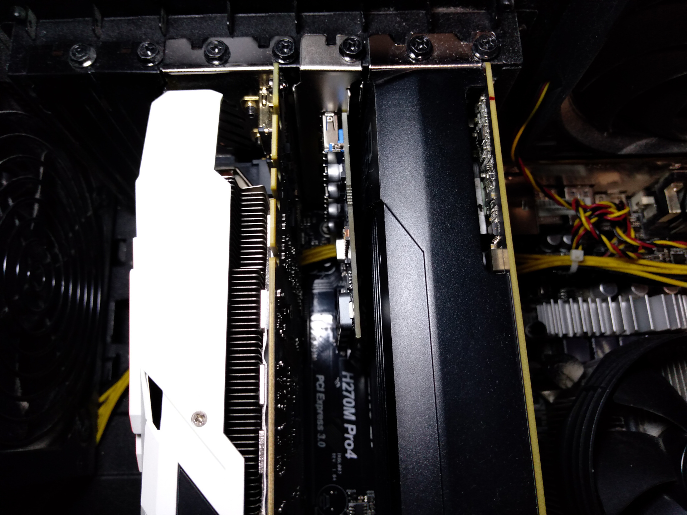
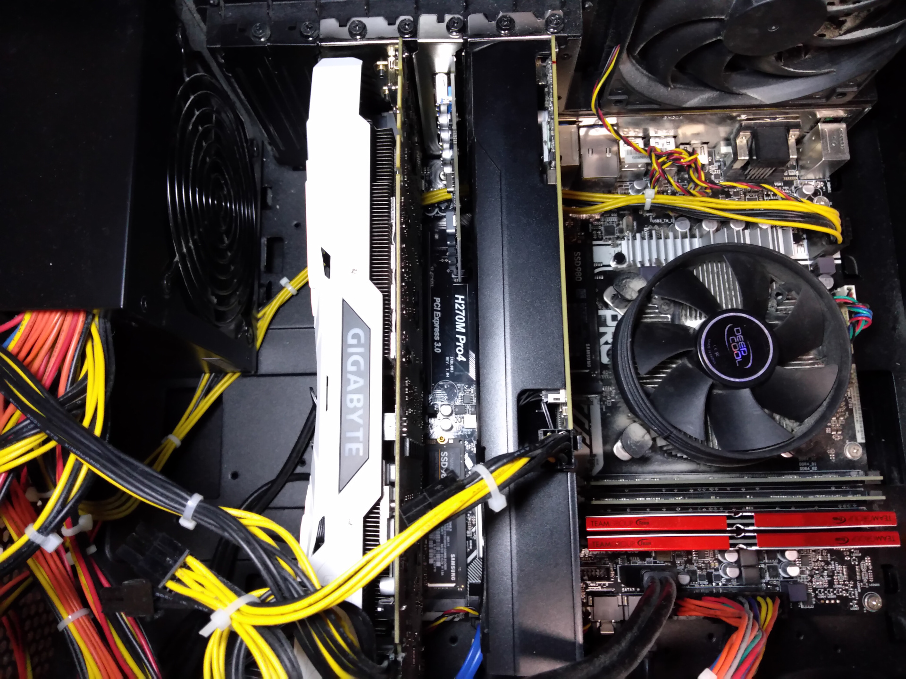
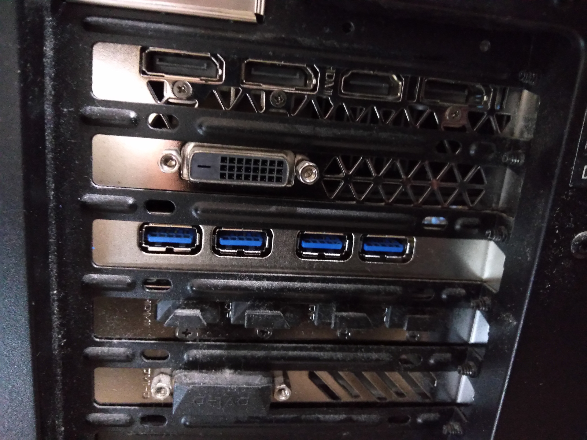

# PCIe USB 3.0増設ボード（ELUTENG）を追加した

- [Amazon.co.jp: ELUTENG USB3.0 増設ボード 4ポート 2ポート インターフェースカード 外部給電不要 独立給電 5Gbps高速伝送 拡張カード 独立コンデンサー 過電流保護 良い安定性 PCIE x16 x8 x4 x1対応 PCIE Express to USB3.0 Win10 8.1 8 7 XP対応 PS3/PS4 Linux Mac非対応 (４ポート)](https://www.amazon.co.jp/dp/B07CWP8DBT)

10月末に1568円で買っていた。

これまで、USB 3.0の増設用途には、2018年6月に1755円で購入した外部電源付きのUSBハブを使っていた。

- [Amazon.co.jp: エレコム USB3.0 ハブ 4ポート ACアダプタ付 セルフ/バス両対応 ブラック U3H-A408SBK](https://www.amazon.co.jp/dp/B00KKJJCXC)

PC裏は電源やUSBケーブル・オーディオケーブル・LANケーブルなどで配線地獄になってしまう。
また、様々な電源を必要とする機器によって、電源コンセントが埋まってしまう。

主に以下のような目的で、タイトルにある改修をすることにした。

- ケーブルの数を減らす
- 電源コンセントを空ける
- 空いているPCIeポートを活用する
- 拡張ボード挿してみたい

## 作業写真

### 追加前のマザーボード全体

- 多少ほこりっぽかったり、メモリのメーカーがバラバラだったりするのは見逃してほしい
- GPU2枚の間のPCIeポートが空いている

### 設置箇所 拡大

- GPUの排熱の影響を受けそうだけれど、しばらくフルパワーで回していないのでよくわからない
- ここしかポートがないので、よしとする

### 追加後のマザーボード全体

### ケース背面

- USBコネクタの穴が空いている方が上になっているのが標準的な向き（フロントパネルとかノートPCでは普通この向き）だと思っているけれど、この向きでしか設置できないので、よしとする
