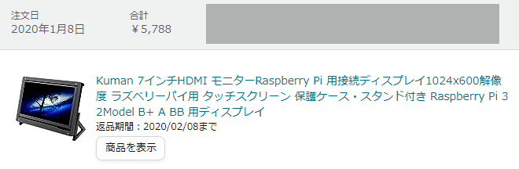
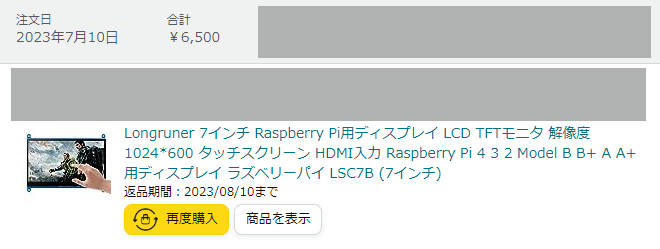
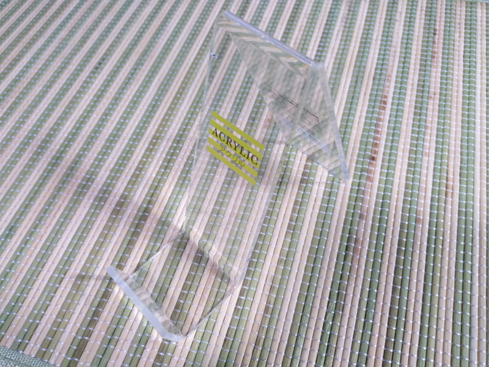
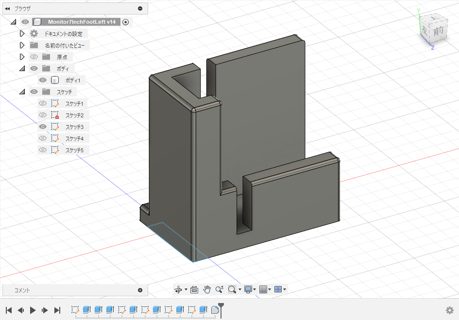
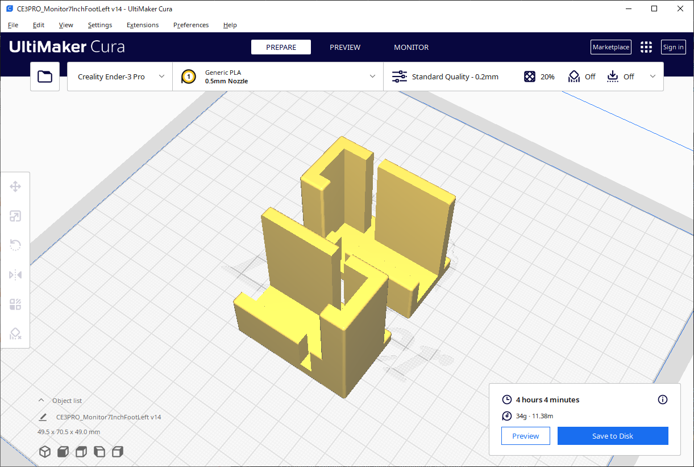

# 3Dプリント 7インチディスプレイの足

Raspberry Pi向け7インチディスプレイを支える足を簡易的に作ってみました。

今回作成したのは、裏面に`7inch HDMI Display 1024x600 Pixel USB Touch Rev2.5`と印字されているディスプレイ基板用のものです。

この規格のディスプレイは、アクリル製の枠と足が付いたセットを2020年に購入したのですが、保管している間に液晶が割れてしまいました。

- [Kuman 7インチHDMI モニターRaspberry Pi 用接続ディスプレイ1024x600解像度 ラズベリーパイ用 タッチスクリーン 保護ケース・スタンド付き Raspberry Pi 3 2Model B+ A BB 用ディスプレイ - Amazon](https://www.amazon.co.jp/dp/B0814SCNP4)
- [aoirint🎐: "7インチディスプレイ（7inch HDMI display …" - mstdn.aoirint.com](https://mstdn.aoirint.com/@aoirint/110685800765768102)

すでにAmazonの商品ページがなくなっていたので、同じディスプレイ基板の代替品を購入しました。

- [Longruner 7インチ Raspberry Pi用ディスプレイ LCD TFTモニタ 解像度1024*600 タッチスクリーン HDMI入力 Raspberry Pi 4 3 2 Model B B+ A A+ 用ディスプレイ ラズベリーパイ LSC7B (7インチ) - Amazon](https://www.amazon.co.jp/dp/B07ZHXC2VG)

同じ基板なので、以前に購入したもののアクリル製の枠を再利用できますが、ネジ留めする足の部分をなくしました。
しばらく以下のような100均のアクリルスタンドを代わりに使っていましたが、安定感向上と角度調整がしたくなったので、遊ばせているEnder-3 Proを使って3Dプリントしてみることにしました。

- [アクリルスタンド（幅３．８ｃｍ） | 【公式】DAISO（ダイソー）ネットストア](https://jp.daisonet.com/collections/stationery0207/products/4550480091280)

モデルデータは、Autodesk Fusion 360の個人用ライセンスで作成・出力しました。

- [Monitor7InchFoot_20230815.1.7z](files/Monitor7InchFoot_20230815.1.7z)
  - Fusion 360のアーカイブファイル（f3d）
  - Fusion 360で出力したSTLファイル（stl）
  - UltiMaker CuraのEnder-3 Pro向けプロジェクトファイル（3mf）
  - UltiMaker Curaで出力したEnder-3 Pro向けGCodeファイル（gcode）

Curaの予測プリント時間は、4時間4分でした。

