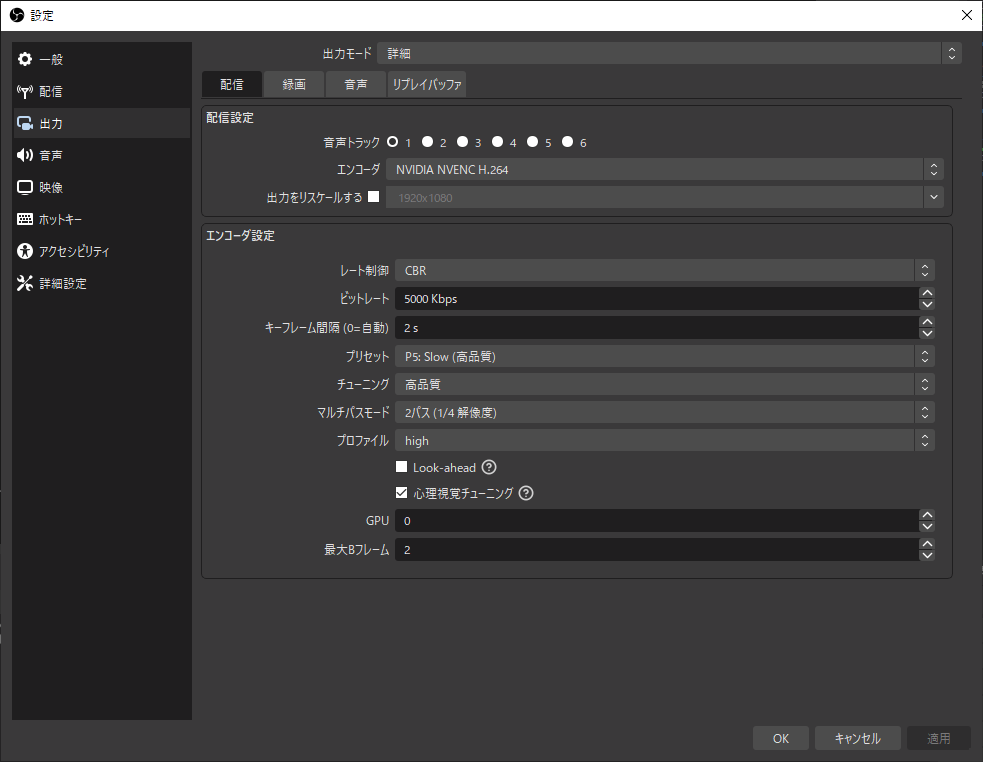

# FFmpegでRTMP中継サーバを立てる

## TL;DR

```shell
ffmpeg -listen 1 -re -y -rtmp_playpath "${STREAM_KEY}" -i "rtmp://0.0.0.0:1935/live" -f flv -rtmp_playpath "${YTLIVE_STREAM_KEY}" "rtmps://a.rtmps.youtube.com/live2" -f flv -rtmp_playpath "${NICOLIVE_STREAM_KEY}" "rtmp://iliveorigin.dmc.nico/named_input"
```

## 背景

以下のような設定で、フルHD配信を5Mbps程度でしている。
[SoraYuki氏の同時配信プラグイン](https://github.com/sorayuki/obs-multi-rtmp)を使って、
ニコニコ生放送、YouTube Liveで同時配信しているので、上り帯域10Mbps程度が必要である。



- GPU: GeForce GTX 1060 6GB

現在の通信環境では、上り帯域の限界ギリギリまで使っていると思われる。
これ以上帯域を使用すると、配信だけでなく、関係のないpingやその他の通信が遅延したり、
ドロップしたりすることが知られている。

また出先など、帯域の細い回線を使っているときには、ビットレートを落とす必要が出る、同時配信できない、などの
問題が予想される。

## 目的

上り5Mbps程度の細い帯域でフルHDの2プラットフォーム同時配信ができるようにする。

## 手法

VPSに配信を中継するRTMPサーバを立てる。

## RTMP URL

ニコニコ生放送: 視聴側はHD（1280x720、3Mbps）だが、配信側はフルHD（1920x1080）で送信しても動作する。

配信元のGPUの負荷を軽減するため、配信先間でエンコーダを共通化している。

ソフトウェアによっては、送信先URLに以下のような設定を要求することがある。

- `rtmps://a.rtmps.youtube.com/live2/{STREAM_KEY}`
- `rtmp://iliveorigin.dmc.nico/named_input/{STREAM_KEY}`

`{STREAM_KEY}`は、OBSや各配信サービスでは、「ストリームキー」という名前で呼ばれる。
RTMPプロトコルのURLの前に`-rtmp_playpath "{STREAM_KEY}"`という引数を追加することで設定できる。

RTMP URLは以下のように構成される。

- [https://ffmpeg.org/ffmpeg-protocols.html#rtmp](https://ffmpeg.org/ffmpeg-protocols.html#rtmp)

```
rtmp://[username:password@]server[:port][/app][/instance][/playpath]
```

- RTMPの標準的なポート番号: 1935
- RTMPSの標準的なポート番号: 443

.

- YouTubeのRTMP URL: `rtmp://a.rtmp.youtube.com/live2`
- YouTubeのRTMPS URL: `rtmps://a.rtmps.youtube.com/live2`
- ニコニコ生放送のRTMP URL: `rtmp://iliveorigin.dmc.nico/named_input`

```shell
ffmpeg -listen 1 -re -y -rtmp_playpath "${STREAM_KEY}" -i "rtmp://0.0.0.0:1935/live" -f flv -rtmp_playpath "${YTLIVE_STREAM_KEY}" "rtmps://a.rtmps.youtube.com/live2" -f flv -rtmp_playpath "${NICOLIVE_STREAM_KEY}" "rtmp://iliveorigin.dmc.nico/named_input"
```

`speed=   1x`で安定していれば、リアルタイム出力ができている。

```shell
frame=58264 fps= 57 q=31.0 q=31.0 size=  624286kB time=00:16:59.40 bitrate=5016.8kbits/s speed=   1x
```
