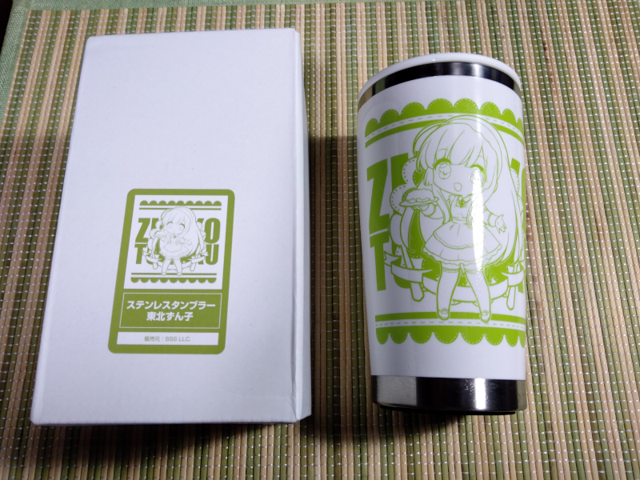
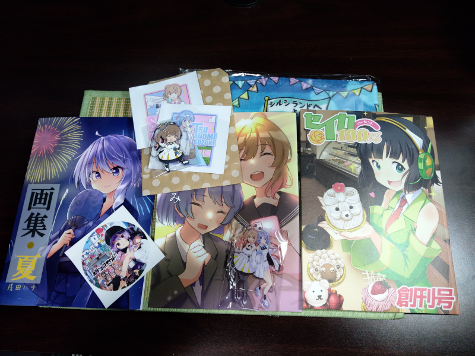
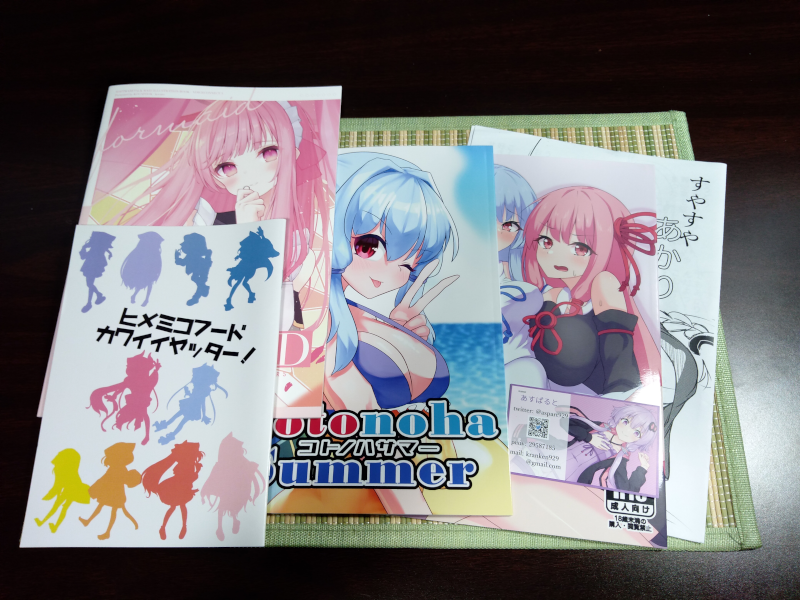
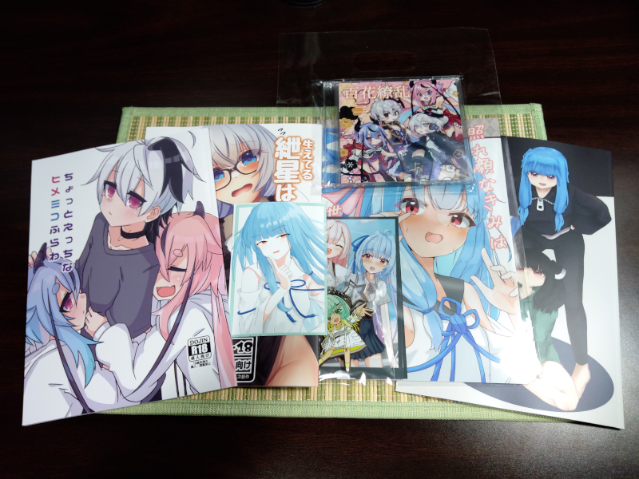
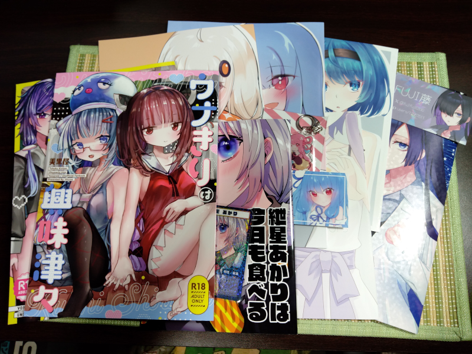
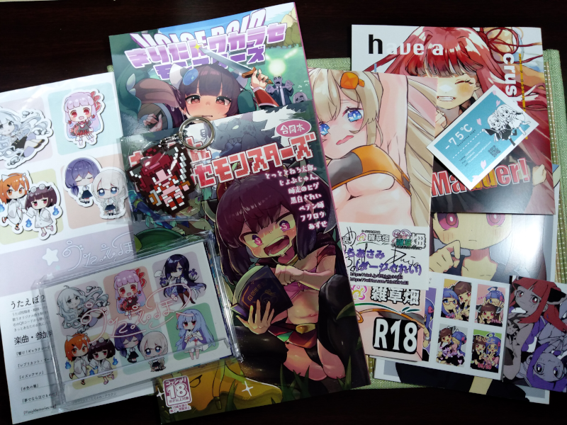
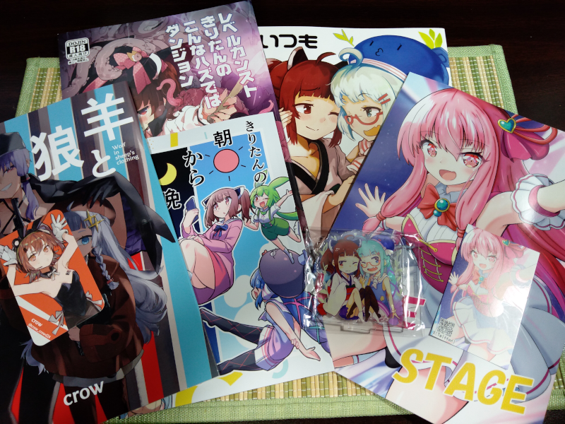
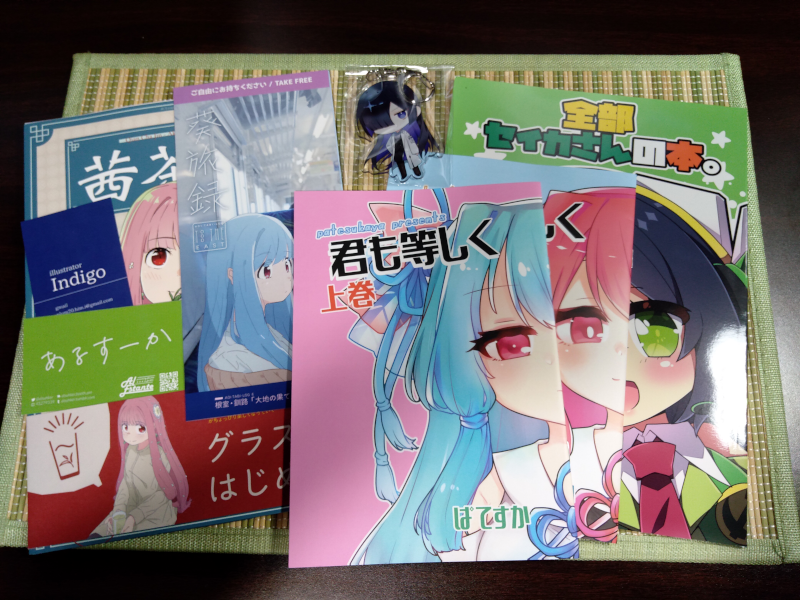

# ボイスコネクト3に一般参加してきました

2023年9月30日、大田区産業プラザPiOで開催された、「ボイスコネクト3」に一般参加してきました。

- [ボイスコネクト](http://voiceconnect.fun/): テキスト読み上げソフト中心の同人即売会
  - 運営Xアカウント: [@voiceconnect_ad](https://twitter.com/voiceconnect_ad)

即売会の参加は、[3月のボイボ寮祭](/2023/voicevox_dormitory_festival/)以来になります。
ボイボ寮祭ではアフターまでいたのですが、今回は総合的に勘案して早めに撤収してしまいました。
次回は準備を整えて、アフターまで残ったり、いずれ二次会ができるといいな...

## 戦利品

以下は戦利品です。300を超えるサークルと15企業が参加するイベントということで、なかなかの数になりました。
ゆっくり楽しませていただいております。

## 今回の反省

さて、以下は今回の反省になります。

硬貨の用意について、今回は郵便局で金種指定の払戻しをしてみたのですが、
計数にかなり時間と手間がかかる手続きで、その間窓口をふさいだので、
利用客の少ない時間ではありましたが、これを無料でやらせるのに遠慮を感じました。
2022年から、50枚を超える（紙幣を含む）場合は金種指定料金という手数料がかかるようになりましたが、
まあ実際に手続きを見て納得が得られました。
ゆうちょ銀行のヘルプにも取り扱い時間の事情が書かれていますね。

- [なぜ、金種指定料金を導入するのですか。 | よくあるご質問 | 株式会社ゆうちょ銀行](https://faq.jp-bank.japanpost.jp/faq_detail.html?id=10251)

> 窓口で金種指定への対応を行うことによって、ほかのお客さまを長時間お待たせする

業務で釣銭の用意などが必要な人も利用しそうで、サービスとしては今後も利用するとは思いますが、
何かこちらで工夫できることがあれば工夫したいですね...
棒金の方が速いとかあるのかな...
間違いがあってはいけないというので、難しそう。

移動について、電車の時間に間に合わせるために急いだことで、急な激しい運動に体調を崩してしまい、乗り合わせた方に心配されてしまいました。
あとすごく汗をかいてしまって、衛生的によろしくないので途中で替えの服を買おうか迷いました。
余裕のある移動計画を立てるとか、制汗剤や消臭剤を用意するとか、次回に活かしたいですね...（ご迷惑をおかけしました）。

## 勝手に宣伝コーナー

以下は、勝手に宣伝コーナーになります。

### 青春系トークボイス 双葉湊音 制作プロジェクト (2023-10-20 ～ 2023-11-29)

2023年10月20日から、株式会社ガソリンアレイさんの音声合成キャラクター「青春系トークボイス 双葉湊音 制作プロジェクト」のクラウドファンディングが始まりました。
記事執筆時点では、開始3時間ほどで第一ゴールの450万円を達成し、第二、第三ゴールの達成を目指しているところでございます。
すでにソングボイスが販売されていますが、新規の音声合成キャラクターが盛り上がってくれるのはとてもうれしいです。もしよろしければ、応援してあげてくださいな。
ご支援される際には、CeVIO AIトークボイスの動作には有償のCeVIO AIトークエディタが別途必要な点、支援金額とは別にうぶごえのシステム利用料がそこそこかかる点など、十分に注意してくださいませ。

- 双葉湊音 公式Xアカウント: [@futabaminato](https://twitter.com/futabaminato)
- うぶごえ（クラウドファンディングサイト）: [青春系トークボイス 双葉湊音 制作プロジェクト](https://ubgoe.com/projects/509)

<blockquote class="twitter-tweet">
『青春系トークボイス <a href="https://twitter.com/hashtag/%E5%8F%8C%E8%91%89%E6%B9%8A%E9%9F%B3?src=hash&amp;ref_src=twsrc%5Etfw">#双葉湊音</a> 制作プロジェクト』 クラウドファンディング開始しました！  あらためて、しっかりとお目通しいただいた上で、 コースのお間違い等ないようご確認いただき、ご支援いただけますと幸いです。  ご支援、応援のほど宜しくお願いいたします。<a href="https://t.co/pCDGPnqVwi">https://t.co/pCDGPnqVwi</a> <a href="https://t.co/VGIr0mmQqY">pic.twitter.com/VGIr0mmQqY</a>
&mdash; 双葉湊音（ふたば みなと）【公式】トークボイス始動！🎤 (@futabaminato) <a href="https://twitter.com/futabaminato/status/1715306867994333623?ref_src=twsrc%5Etfw">October 20, 2023</a></blockquote>

<blockquote class="twitter-tweet">
分かりにくい点や、ご質問いただいたものをまとめました！ この後も随時追加していきますね <a href="https://t.co/pLFKTvBBmB">pic.twitter.com/pLFKTvBBmB</a>
&mdash; 双葉湊音（ふたば みなと）【公式】トークボイス始動！🎤 (@futabaminato) <a href="https://twitter.com/futabaminato/status/1714910440638267755?ref_src=twsrc%5Etfw">October 19, 2023</a></blockquote>

<blockquote class="twitter-tweet">
「ふたばこみなと」実現へ🌱 第二ゴールに向けて、引き続きご支援よろしくお願いいたします！ <a href="https://twitter.com/hashtag/%E5%8F%8C%E8%91%89%E6%B9%8A%E9%9F%B3?src=hash&amp;ref_src=twsrc%5Etfw">#双葉湊音</a> <a href="https://t.co/pCDGPnrtlQ">https://t.co/pCDGPnrtlQ</a> <a href="https://t.co/IRfa88hy4d">https://t.co/IRfa88hy4d</a> <a href="https://t.co/nlHA0iA523">pic.twitter.com/nlHA0iA523</a>
&mdash; 双葉湊音（ふたば みなと）【公式】トークボイス始動！🎤 (@futabaminato) <a href="https://twitter.com/futabaminato/status/1715384696006447493?ref_src=twsrc%5Etfw">October 20, 2023</a></blockquote>

- 支援報告: [かのみや: "パートナーになりました！ 青春系トークボイス 双葉湊音 制作…" - mstdn.aoirint.com](https://mstdn.aoirint.com/@kanomiyanic/111266939770714781)

### Each of Voice.2023 (2023-10-22)

2023年10月22日には、横浜産貿ホール マリネリアで、今回が最後となるEach of Voice.2023（EofV2023）が開催されます。
私は残念ながら参加を予定していないのですが、参加される皆さま、お気を付けて、楽しんでいってらっしゃいませ。

- [Each of Voice.2023](https://eachofvoice.com/): 合成音声キャラクターのオンリーイベントが集まった同人即売会
  - 運営Xアカウント: [@Each_of_Voice](https://twitter.com/Each_of_Voice)

<blockquote class="twitter-tweet">
【一般参加チケット発売中💫】 一般参加にはチケットが必要です🎫当日券では、開会同時（12:00）に入場することはできません⚠️ 前売券（1200円）はLivePocketで販売中！ 当日券（1000円）は、開会後12:30以降入場が可能です。 詳しくはこちら<a href="https://t.co/p1VNspTVCs">https://t.co/p1VNspTVCs</a>
&mdash; Each of Voice.#EofV (@Each_of_Voice) <a href="https://twitter.com/Each_of_Voice/status/1713882861294809594?ref_src=twsrc%5Etfw">October 16, 2023</a></blockquote>

### VOICEVOX 2周年記念コラボカフェ (2023-10-31 ～ 2023-11-19)

2023年10月31日から11月19日にかけて、秋葉原のメイドカフェWhite & CrossLoadさんで、VOICEVOX 2周年記念コラボカフェが開催されます（執筆者はVOICEVOXの開発に協力しています）。

- [White ＆ CrossLoad〔ホワイトアンドクロスロード〕](https://whitecrossload.girly.jp/)

<blockquote class="twitter-tweet">
【イベント告知】 VOICEVOX2周年記念コラボカフェ開催‼️  無料で使える中品質なテキスト読み上げソフトウェアVOICEVOXの2周年記念コラボカフェイベントを秋葉原で開催します🏤… <a href="https://t.co/0QqOZoBewa">pic.twitter.com/0QqOZoBewa</a>
&mdash; ホワクロ【公式】秋葉原White&amp;CrossLoadカフェ🏤 (@whitecrossload) <a href="https://twitter.com/whitecrossload/status/1710578700784443442?ref_src=twsrc%5Etfw">October 7, 2023</a></blockquote>

<blockquote class="twitter-tweet">
【🎉 コラボカフェのお知らせ 🎉】  ホワイトクロスロード様 <a href="https://twitter.com/whitecrossload?ref_src=twsrc%5Etfw">@whitecrossload</a> のご厚意で、VOICEVOXのコラボカフェが実現しました！🎊  10月31日(火)～11月19日(日)の期間、秋葉原の店舗にて開催されます！ぜひご来店ください！<a href="https://twitter.com/hashtag/VOICEVOX?src=hash&amp;ref_src=twsrc%5Etfw">#VOICEVOX</a> <a href="https://twitter.com/hashtag/%E7%A7%8B%E8%91%89%E5%8E%9F?src=hash&amp;ref_src=twsrc%5Etfw">#秋葉原</a> <a href="https://twitter.com/hashtag/%E3%82%B3%E3%83%A9%E3%83%9C%E3%82%AB%E3%83%95%E3%82%A7?src=hash&amp;ref_src=twsrc%5Etfw">#コラボカフェ</a> <a href="https://t.co/0EMdqce0CV">https://t.co/0EMdqce0CV</a>
&mdash; VOICEVOX (@voicevox_pj) <a href="https://twitter.com/voicevox_pj/status/1710596044021711078?ref_src=twsrc%5Etfw">October 7, 2023</a></blockquote>

### SEIKAサブカルフェスタ2023 & SEIKAクリエイターズ祭 (2023-11-19)

2023年11月19日には、京都府精華町 けいはんなオープンイノベーションセンターKICKで、SEIKAサブカルフェスタ2023、SEIKAクリエイターズ祭が開催されます。
京都府精華町の音声合成キャラクター 京町セイカは、クラウドファンディング [京町セイカRebootプロジェクト](https://greenfunding.jp/lab/projects/6727)を通じて、2023年10月5日に音声合成ソフトVOICEPEAKが発売されております。

- [SEIKAサブカルフェスタ2023](https://subculfesta.kyomachi-seika.jp/): 京都府精華町で開催されるサブカルチャーの祭典
- [SEIKAクリエイターズ祭](https://seika-creators.com/): SEIKAサブカルフェスタ2023と同時開催のオールジャンル即売会
- [VOICEPEAK 京町セイカ｜製品情報｜AHS(AH-Software)](https://www.ah-soft.com/voice/seika/)
- [京町セイカＲｅｂｏｏｔプロジェクト | GREENFUNDING](https://greenfunding.jp/lab/projects/6727)
- [『VOICEPEAK 東北イタコ』『VOICEPEAK 京町セイカ』『ぴた声 京町セイカ vol.2』2023年10月5日発売 - AHS プレスリリース](https://www.ah-soft.com/press/voice/20230914.html)
