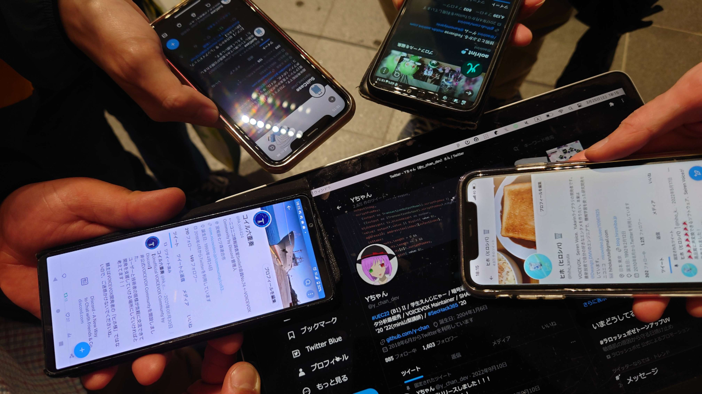
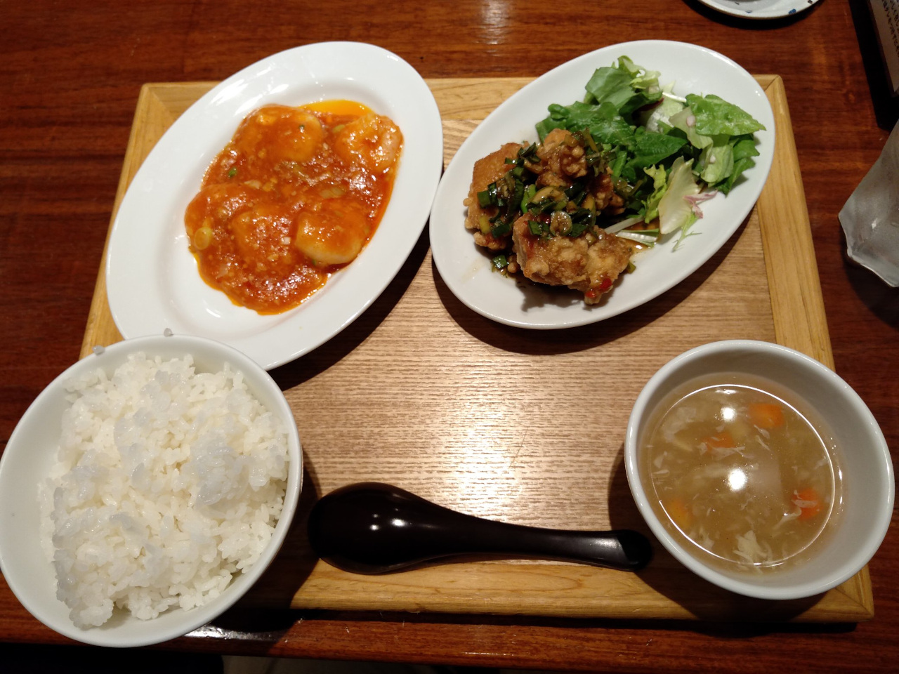
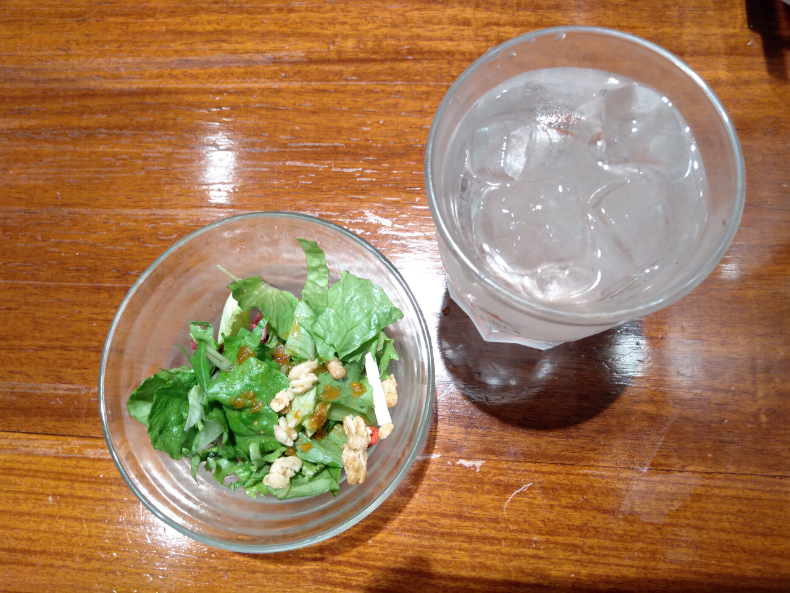
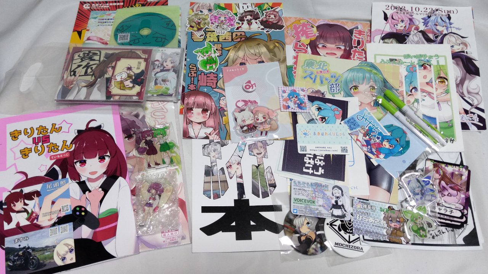
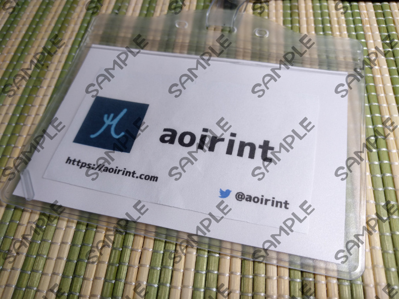
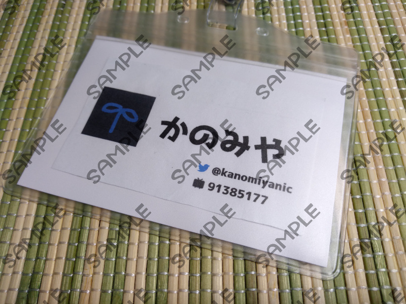

# ボイボ寮祭・ずんだぱ～てぃ9に一般参加してきました

2023年3月25日、川崎市産業振興会館で開催された、「ボイボ寮祭」および「ずんだぱ～てぃ9」に一般参加してきました。

- [ボイボ寮祭](https://voicevox.net/): VOICEVOXオンリーの同人誌即売会
- [ずんだぱ～てぃ](https://zunko.moe/): ずんだホライずん（東北ずん子プロジェクト）オンリーの同人誌即売会

<blockquote class="twitter-tweet">
【一般参加まとめ】 イベント開催は12:00から 入場には事前登録が必要→LivePocketで1200円<a href="https://t.co/RcMwSaryW9">https://t.co/RcMwSaryW9</a> 当日対応は1500円  〈コスプレ〉 事前登録してね→LivePocketで600円<a href="https://t.co/Xbm2s3vGE1">https://t.co/Xbm2s3vGE1</a> 余裕があれば当日受付1000円 Webサイト確認してね<a href="https://t.co/ehJIQqm6zN">https://t.co/ehJIQqm6zN</a><a href="https://twitter.com/hashtag/%E3%83%9C%E3%82%A4%E3%83%9C%E5%AF%AE%E7%A5%AD?src=hash&amp;ref_src=twsrc%5Etfw">#ボイボ寮祭</a>
&mdash; ボイボ寮祭 (@voivo_only) <a href="https://twitter.com/voivo_only/status/1634562114412253184?ref_src=twsrc%5Etfw">March 11, 2023</a></blockquote>

<blockquote class="twitter-tweet">
【一般参加まとめ】 イベント開催は12:00から 入場には事前登録が必要→LivePocketで1200円<a href="https://t.co/fhdPbPboGU">https://t.co/fhdPbPboGU</a> 当日対応は1500円  〈コスプレ〉 事前登録してね→LivePocketで600円<a href="https://t.co/X5hcXVB0hE">https://t.co/X5hcXVB0hE</a> 余裕があれば当日受付1000円  Webサイト確認してね<a href="https://t.co/mMWYiL6bTd">https://t.co/mMWYiL6bTd</a><a href="https://twitter.com/hashtag/%E3%81%9A%E3%82%93%E3%81%B1?src=hash&amp;ref_src=twsrc%5Etfw">#ずんぱ</a>
&mdash; ずんだぱ～てぃ準備会 (@zunda_party) <a href="https://twitter.com/zunda_party/status/1634562157512921088?ref_src=twsrc%5Etfw">March 11, 2023</a></blockquote>

同人誌即売会の一般参加は[2022年3月のボイスコネクト2](/entry/2022/03/28/voiceconnect2_post)（VOICEROID、CeVIO中心の同人即売会）以来です。
ちなみに、[ボイスコネクト3は、2023年9月30日に2022年3月と同じ大田区産業プラザPiOで開催予定](https://twitter.com/voiceconnect_ad/status/1634932264558825472)です。

<blockquote class="twitter-tweet">
川崎に着弾
&mdash; aoirint🎐 (@aoirint) <a href="https://twitter.com/aoirint/status/1639460283168210944?ref_src=twsrc%5Etfw">March 25, 2023</a></blockquote>

## VOICEVOXオフ

オフラインでVOICEVOX関係者と会う貴重な機会で、
VOICEVOX開発者の[ヒホ](https://twitter.com/hiho_karuta)さん、
VOICEVOXコミュニティDiscord運営の[コイル六重奏](https://twitter.com/hk_coil424)さん、
SHAREVOX開発者・VOICEVOXメンテナーの[Yちゃん](https://twitter.com/y_chan_dev)、
VOICEVOXレビュワーの[SuitCase](https://twitter.com/pickled_chair)さんとお会いして、
夕食をご一緒しました。

<blockquote class="twitter-tweet">
VOICEVOXコントリビューター(広義)エンカ会<a href="https://twitter.com/hiho_karuta?ref_src=twsrc%5Etfw">@hiho_karuta</a><a href="https://twitter.com/hk_coil424?ref_src=twsrc%5Etfw">@hk_coil424</a><a href="https://twitter.com/pickled_chair?ref_src=twsrc%5Etfw">@pickled_chair</a> <a href="https://twitter.com/aoirint?ref_src=twsrc%5Etfw">@aoirint</a> <a href="https://t.co/jWpRS9tFkN">pic.twitter.com/jWpRS9tFkN</a>
&mdash; Yちゃん (@y_chan_dev) <a href="https://twitter.com/y_chan_dev/status/1639558087760826368?ref_src=twsrc%5Etfw">March 25, 2023</a></blockquote>

<blockquote class="twitter-tweet">
ごはん！ <a href="https://t.co/OPjdZoo55m">pic.twitter.com/OPjdZoo55m</a>
&mdash; aoirint🎐 (@aoirint) <a href="https://twitter.com/aoirint/status/1639603865451630592?ref_src=twsrc%5Etfw">March 25, 2023</a></blockquote>

夕食では、ラゾーナ川崎プラザ 4Fのチャイニーズレストラン 西安餃子で海老チリ＆油淋鶏セットをいただきました。

## 戦利品

<blockquote class="twitter-tweet">
戦利品！ <a href="https://t.co/o4FgISabZg">pic.twitter.com/o4FgISabZg</a>
&mdash; aoirint🎐 (@aoirint) <a href="https://twitter.com/aoirint/status/1639921011008339971?ref_src=twsrc%5Etfw">March 26, 2023</a></blockquote>

今回は、Googleスプレッドシートにほしい頒布物を並べて印刷したものを用意し、会場配置図を印刷したものと一緒にクリアファイルに挟んで持ち込むという方式にしてみました。
前回はタスク管理ツールのボードを使って管理していましたが、その方式のことはすっかり忘れていました。

## 名札

前回は、Seiren Voiceのデモに赴くにあたって、アイコンで本人確認してもらうために、
TwitterかGitHubのプロフィール画面をスマートフォンで見せる、という方式をとっていましたが、
今回は、[動画投稿者のシルシラさんのツイート](https://twitter.com/sirusira/status/1639147553861283846)をみて、A4コピー用紙に印刷した簡易的な名刺を作って、名札をかけるという方式にしました。

さよみこうしき（VOICEVOX小夜さん・櫻歌ミコさんの合同）ブースに集まっていたヒホさんとVOICEVOX関係者に挨拶するときと、
雨晴はうさんブースの「診察券」頒布で活躍しました。

本当に念のために用意した名札の予備を前述のクリアファイルに挟んでいたのですが、会場で落としそうで結構ひやひやしました。

aoirintのアイコンは、どうにもCMYKで表現するのが難しい色域らしく、ふつうに印刷するとそこそこ色味が変わってしまいます。
実は、前回はアイコンの缶バッジを用意するというこじゃれたことをしており（活躍する機会は残念ながらなかったのですが）、
そのときは許容範囲だと思っていました（そのときはコンビニのコピー機も試しましたが、家庭用プリンターCanon MG3530の方がいい結果でした）。
今回は、（配ることは想定していないものの）名刺形式ということもあり、少しでも色味を近づけるため、Macbookを開き、標準ソフトでCMYK変換しました。
これで、少し色あせた程度に色味の変化を抑えることができたように思います。WindowsやLinuxでもできるとうれしいですね。

名刺の画面構成は、ローカルフォント（ラノベポップ V2）を使うため、diagrams.net（drawio）のデスクトップアプリを使いました。

裏面は、動画投稿者名義の名札になっています。

Twitterのアイコンは、以下の公式ブランドツールキットから使っています。

- [https://about.twitter.com/en/who-we-are/brand-toolkit](https://about.twitter.com/en/who-we-are/brand-toolkit)

ニコニコのアイコンは、2023年2月に（ようやく）公式に公開されたロゴ（シンボルマーク）を使っています。
「ニコニコでの活動を多くの人に知ってほしい！というクリエイターのみなさんに向け」ということで公開されたロゴなので、この用途は大丈夫でしょう。

- [https://commons.nicovideo.jp/material/nc296561](https://commons.nicovideo.jp/material/nc296561)

各アイコンのガイドラインとにらめっこして電卓を打ちながらサイズと余白を調整しましたが、微調整や印刷によるズレが多少あるかも。
こういうところは有償組版ソフトが強そうだと思いました。
