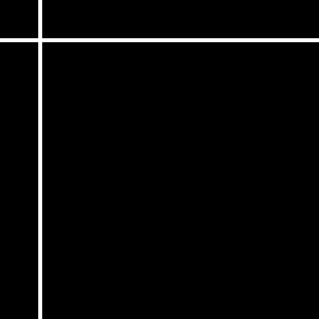
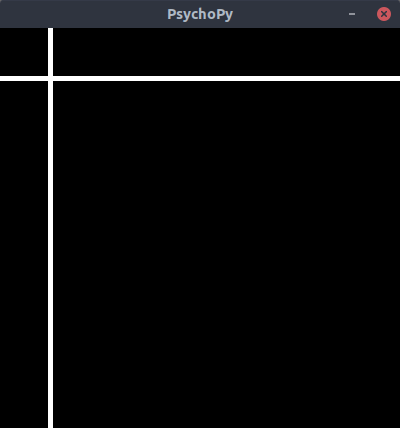

.. article::
  :canonical_url: ./
  :date: 2021-02-14 22:00:00
  :category: Psychopy
  :tags: Python, Psychopy, OpenCV
  :draft: false

###############################################
PsychopyでOpenCV画像をImageStimで表示する
###############################################

PsychopyでOpenCV画像をImageStimで表示する
=========================================

`Psychopy - GitHub <https://github.com/psychopy/psychopy>`_

y軸反転と画素値をfloat（0-1）に変換すればOK。

.. code-block:: python

    npimg: np.ndarray # (height, width, num_channels)
    stimimg = np.flip(npimg.astype(np.float32) / 255, axis=0)

ウインドウに表示させるサンプル
-----------------------------------------

.. code-block:: python

    import numpy as np # numpy>=1.20.1
    import cv2 # type: ignore # opencv-python>=4.5.1.48
    from psychopy import core # type: ignore # psychopy>=2020.2.10
    from psychopy.visual import Window, ImageStim # type: ignore
    import sys

    # npimg: np.ndarray = cv2.imread('image.png', 1)
    npimg: np.ndarray = np.zeros((400, 400, 3), dtype=np.uint8)
    npimg = cv2.line(npimg, (0, 50), (400, 50), (127, 127, 127), 3)
    npimg = cv2.line(npimg, (50, 0), (50, 400), (255, 255, 255), 3)
    # cv2.imwrite('image.png', npimg)

    stimimg = np.flip(npimg.astype(np.float32) / 255, axis=0)

    window = Window((400, 400), color='black', units='pix')

    stim = ImageStim(window, pos=(0, 0), size=(400, 400))
    stim.image = stimimg

    stim.draw()
    window.flip()

    core.wait(3)

    # while True:
    #     stim.draw()
    #     window.flip()
    #
    #     for keys in event.getKeys(timeStamped=True):
    #         if keys[0] in [ 'escape', 'q' ]:
    #             sys.exit(0)
    #
    #     core.wait(0.01)
