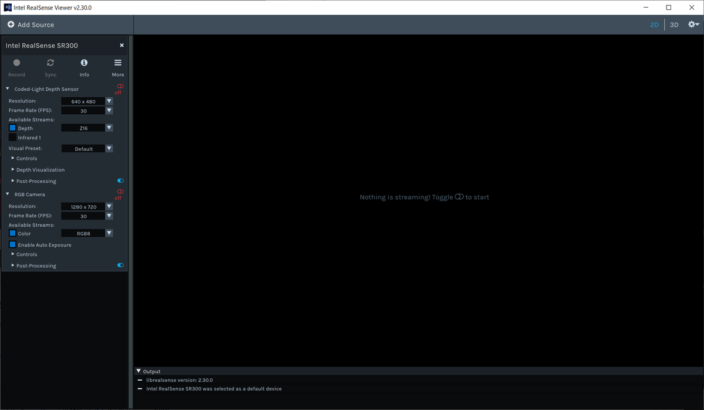

---
# moved from https://aoirint.hatenablog.com/entry/2019/11/23/084759
title: RealSenseのカラー画像が暗い
date: '2019-11-23T08:47:59+09:00'
draft: false
channel: 技術ノート
category: Python
tags:
- Python
- RealSense
---
# RealSenseのカラー画像が暗い

使用：Intel RealSense SR300

pyrealsense2からget_color_frameで取得したカラー画像が暗かった。

RealSense SDKをインストールしてRealSense Viewerで確認してみると、RGB Cameraの項の`Enable Auto Exposure`の値がOFFになっていた。これをONにしたらプレビュー画像が明るくなった（露光の自動調整機能かな）。



次はコード（Python）からこのオプションを有効にする。（Pythonの）サンプルにはオプションをいじってるいい感じのものが見つからなかったので、以下を参考にしつつipythonで探した。

- [RealSense+Pythonの1コマンド環境構築 - Qiita](https://qiita.com/namahoge/items/6e9c7a0a1a27c99a6390)
- [enable/disable auto exposure · Issue #3141 · IntelRealSense/librealsense · GitHub](https://github.com/IntelRealSense/librealsense/issues/3141)

デバイスとカラーセンサ（カメラ）を見つける部分（前半）は適当だけど、コード全体はこんな感じ。

```python
import pyrealsense2 as rs
import numpy as np
import cv2

ctx = rs.context()
device_list = ctx.query_devices()
num_devices = device_list.size()
print(num_devices)
assert num_devices > 0

device = device_list[0]
sensors = device.query_sensors()

color_idx = -1
for i in range(len(sensors)):
    if not sensors[i].is_depth_sensor():
        color_idx = i
        break
assert color_idx != -1

color_sensor = sensors[color_idx]
color_sensor.set_option(rs.option.enable_auto_exposure, 1) # on

pipeline = rs.pipeline(ctx=ctx)
config = rs.config()
config.enable_stream(rs.stream.color, 640, 480, rs.format.bgr8, 30)

pipeline.start(config)

print('Initialized')

try:
    while True:
        frames = pipeline.wait_for_frames()
        color_frame = frames.get_color_frame()
        if not color_frame:
            print('no frame')
            continue

        color_image = np.asanyarray(color_frame.get_data(), dtype=np.uint8)
        print(color_image.max(), color_image.min())
        print(color_image.shape)

        cv2.namedWindow('RealSense', cv2.WINDOW_AUTOSIZE)
        cv2.imshow('RealSense', color_image)
        cv2.waitKey(1)

finally:
    pipeline.stop()
```

センサに対してオプションを設定する部分。

```python
color_sensor = sensors[color_idx]
color_sensor.set_option(rs.option.enable_auto_exposure, 1) # on
```
