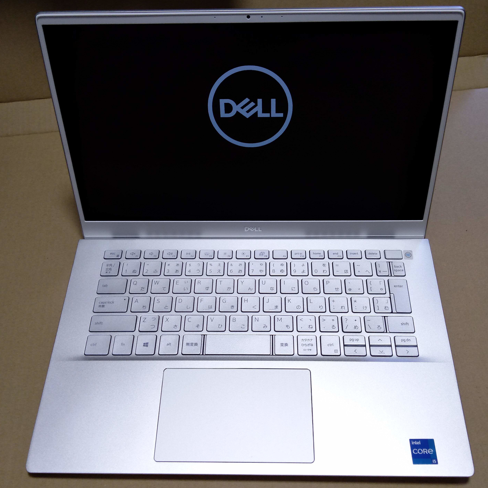
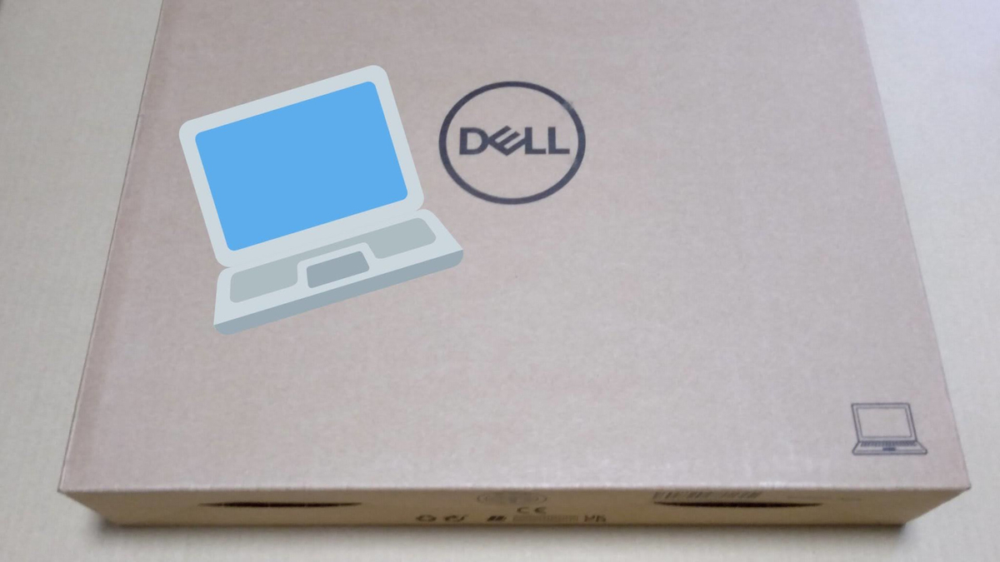
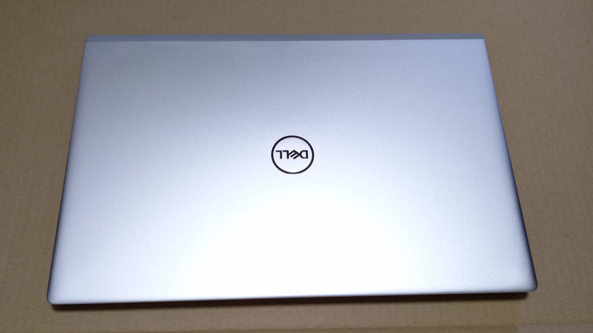

# 【My new gear...】Dell Inspiron 14 5402 Intel Core i5 ラップトップ向け第11世代 Tiger Lake 14インチ ノートパソコン

- [https://www.amazon.co.jp/dp/B08QJ6Y27V](https://www.amazon.co.jp/dp/B08QJ6Y27V)
  - ときどきセール価格になる

持ち出し用Windows/Ubuntu機として購入。
自前でPCを（一応でも）新品で買うのは初めて。
最新のCPUを搭載したPCを買うのも初めて。

本機はサポーターズ ウインターハッカソン vol.7 最優秀賞の支援金30000+1000円と、
これまでの積読でためたAmazonポイントを消費し、
セール中であり（関係ないか?）、
若干の不安は残るもののAmazon アウトレットであり、
（実質的に）定価の3分の1近い値段で購入することができた。
特に支援金の力が大きい、感謝します（MacBookを買えって? 知らんな..）。

キーボードについて、
キーストロークの浅いキーボード、
ノートPCでありがちな幅の狭いキーボード、
InsertやHomeなどのキー配置が特殊なキーボードを避けて選んだ。

キーストロークについて、
以前使っていたFujitsu Lifebook S904はキーストロークが1.0mmと浅く、苦手だった（タイプするとぺたぺたする）。
よくあるノートPCのキーストロークは1.5mm程度らしく、このあたりを目指していた。
2015-2019年あたりのMacBookのバタフライキーボードはわからないが、おそらくキーストロークが（限界まで）浅いので苦手だと思う。
2014年以前のMacBookのキーボードは好きである。

キーの幅について、
Ideapad U310はカンマやピリオド周辺のキー幅が文字キーよりも狭く誤タイプしやすかった（右Shiftキーを大きくするためか）。
生協PCとして名高いLet's noteも幾度か触ったことはあるが、キーが小さいため誤タイプしやすく、苦手である。

キー配置について、
Ideapad U310はBackspace/Enterキーの右側にHomeやEndキーがあり、誤タイプしやすかった（入力中に文書の最初/最後までキャレットが移動してしまう）。

ところで、JISキーボードよりUSキーボードの方が好きである。
最近使っているMacBookはUSキーボードなのだが、
Backspaceキーが大きく、
キー配置が素直である（無理やり詰め込んでいない）。
しかしUSキーボードのWindows ノートPCを手に入れるのは状況的にむずかしい部分があり、
キーボード配置をレビュー写真で確認した上でJISキーボードにした。
また、AppleやHHKB系のキーボードでないのなら、半角/全角キーはほしい気がする。
本機はBackspaceキーがBackslashキーに押されてかなり小さく、不安は残るが、これは慣れで対処するつもりである（文字キーの2/3程度の大きさ。USキーボードの場合、文字キーの4/3倍程度の大きさ）。
Amazonの写真はだいたいUSキーボード（※実際はJISキーボードです、のような感じ）なので、~~優良誤認~~つらいところがある。

トラックパッドについて、
Ideapad U310では、キーボード入力中に触ってしまってキャレットが外れてしまったり、見当違いの位置に移動してしまうことがよくあった。
この点は、今のところは問題なさそうである。

CPUについて、互換性に不安を残したくなかったため、Intel CPUにした。
予算を引き上げればARM M1 Mac、引き下げればAMD Ryzenが視野に入るが、
前者はMac/Windows/Ubuntuトリプルブートなどという環境にすることになりかねないほか、ARM CPUは開発用途ではまだまだ人柱的な要素が強いように思う。もう少し普及を待ちたい。
AMD Ryzenは残念ながら使ったことはないが、一応は数値計算をする人の端くれとして、Intel MKLの互換性などで問題が起こる可能性があるため避けた。
これまで価格の関係で古いCPUばかり使っていたが、ノートPC向けとはいえ本機はIntel 第11世代 CPUなので、浦島になれる気がする（といいつつCore i3ではなくi5にしてしまったのだが）。

RAMについて、スロット8GBx1、空きスロットx1という、いい感じに増設の余地を残した状態なのが好ましい。
デュアルチャネルも捨てがたいが、空きスロットがあることでメモリを買うのが1枚だけでよくなる。
また最近のノートPCは製造簡略化、薄型軽量化のためか基板にRAMを組み込んでいるものがあるらしい。増設したい場合は気をつける必要があるだろう。
またDDR4なので過去に使っていたノートPCからメモリを移植できると思われる。

OSについて、昨年3月末から4月頭にメインのUbuntu/Windows持ち出し機だったFujitsu Lifebook S904がお亡くなりになった。
原因は映像ケーブルの断線と思われるが、ファン音が大きい（座学やカフェでの利用はむずかしい）、キーストロークが浅いなどの問題もあるため修理しなかった。
基本的にPCはWindows/Ubuntuデュアルブートにしてはいるが、メインはUbuntuのため、Windowsはまともに環境構築していない。
Lifebookは全周囲ディスプレイ Uplight開発の関係などでWindowsメインの期間もあり、それなりに環境は整っていたのだが、故障により2020年度は1年間常用できるWindows環境なしで過ごしていた。
卒業研究もUbuntuで進めた。

しかし世の中ではWindowsがよく使われているため、なにかと不便である。
Excel方眼紙の編集、共有されたPowerPointの編集（Office Onlineではうまく編集できない場合がある）、
Fusion 360ほかWindows専用ソフトなどが問題になる。
全盛期からはだいぶ過ぎている気はするが、Voiceroidがおもしろそうだったというのも理由の1つであり、rekordboxも試してみたかったし、VRに手を出す可能性もある。
Visual Studioが使えるため、Unity開発もやりやすくなるだろう。
外部GPUがないのであまり性能に期待はできないが、Steamセールで買ったWindows専用ゲームにも手を出せるかもしれない（Steam OS/Linuxに対応しているゲームは神ゲーである。7 Days to Dieとか）。

この1年はLinuxを快適に使うため、Dockerイメージの作成がマイブームだったが、一段落してしまった気がする。
これからもDocker、開発環境系、ターミナルが使いやすい、などの関係でメインはUbuntuなのだが、持ち出し用にWindowsとMacを合わせたい。
というわけで、しばらくはWindows機として使っていこうと考えている。Ubuntu的要素はひとまずVMかWSLで埋めたい
（重量の関係で外部GPUもないので、といいつつ、WSLはCUDAが使えるようになったんだったか?）。
また、M.2 SSDが256GBしかないので、デュアルブートにするのは容量に不満が出るかもしれないというのも理由の1つである。
そのため本機はひとまず、もしDocker Desktop for WindowsやWSLの利用上で不満が出たらデュアルブートにするかもしれない、というような立ち位置にしておく。

スクリーンについて、
Ideapad U310は古いPCのため最大解像度が低く、1366x768であった。
本機はフルHD 1920x1080である。
また、インチ数は14インチと、主流と思われる13.3インチより少し大きめだが、15.6インチよりは小さい。
しかしベゼル幅が小さいため、古い13.3インチPCと同じような大きさと考えて14インチとした。持ち運べるならば画面は広いほうがいい。
実際、13.3インチのIdeapad U310とほぼ同じ大きさである。13.3インチのMacBookより横に1-1.5cmほど長い。

最後に若干残る不安について。
Windows機を買ったのはひさしぶりなのだが、メーカーから完全な新品を購入した場合を除いて、
OS領域やOEM領域が悪質な（中間）所有者によって改ざんされていないことを保証する仕組みはあるのだろうか?
警戒しつつ最優先でWindows Updateし、Windows Defenderを信用することにしたが、
正直ISOを（別のコンピュータで）MicrosoftのWebサイトから落としてクリーンインストールしたい気持ちだ。
その場合いろいろと難点がある気がするが..

---

梱包

クラムシェル（ふた）

起動画面・キーボード
