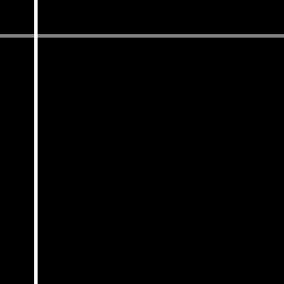
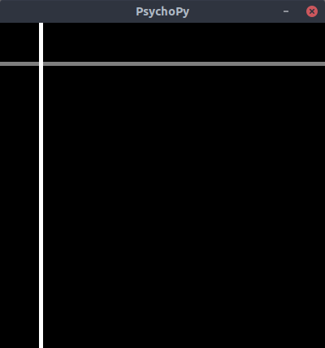

# PsychopyでOpenCV画像をImageStimで表示する

- [Psychopy - GitHub](https://github.com/psychopy/psychopy)





y軸反転と画素値をfloat（0-1）に変換すればOK。

```python
npimg: np.ndarray # (height, width, num_channels)
stimimg = np.flip(npimg.astype(np.float32) / 255, axis=0)
```

## ウインドウに表示させるサンプル

```python
import numpy as np # numpy>=1.20.1
import cv2 # type: ignore # opencv-python>=4.5.1.48
from psychopy import core # type: ignore # psychopy>=2020.2.10
from psychopy.visual import Window, ImageStim # type: ignore
import sys

# npimg: np.ndarray = cv2.imread('image.png', 1)
npimg: np.ndarray = np.zeros((400, 400, 3), dtype=np.uint8)
npimg = cv2.line(npimg, (0, 50), (400, 50), (127, 127, 127), 3)
npimg = cv2.line(npimg, (50, 0), (50, 400), (255, 255, 255), 3)
# cv2.imwrite('image.png', npimg)

stimimg = np.flip(npimg.astype(np.float32) / 255, axis=0)

window = Window((400, 400), color='black', units='pix')

stim = ImageStim(window, pos=(0, 0), size=(400, 400))
stim.image = stimimg

stim.draw()
window.flip()

core.wait(3)

# while True:
#     stim.draw()
#     window.flip()
#
#     for keys in event.getKeys(timeStamped=True):
#         if keys[0] in [ 'escape', 'q' ]:
#             sys.exit(0)
#
#     core.wait(0.01)
```
