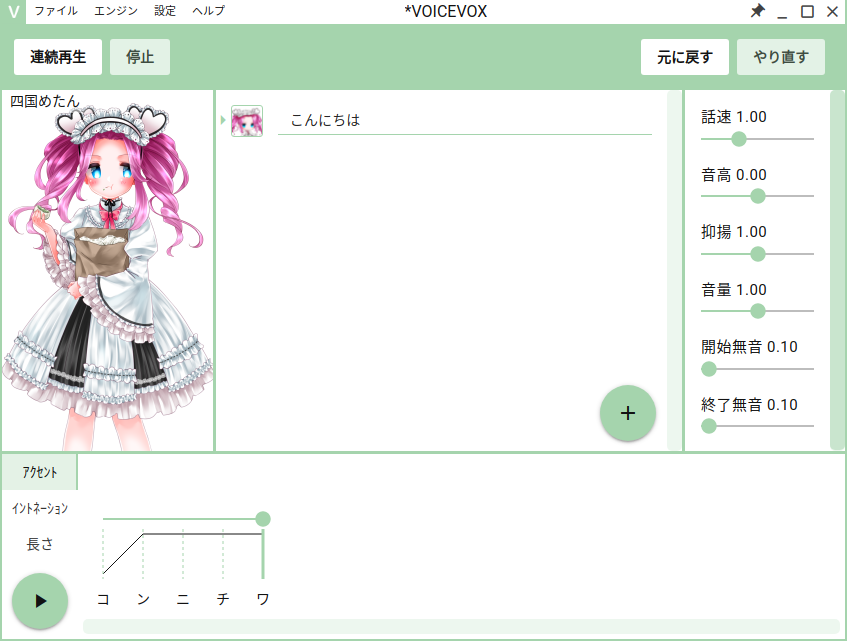

# テキスト読み上げソフトVOICEVOXのビルドを自動化した（コンテキスト共有編）

- [目次](../voicevox_autobuild/)

---

- 内容
  - コンテキストの共有
  - モチベーションの確認
  - 技術情報の共有

---

## ここを必ず読んでね

こちらの記事は、1コントリビュータ、1ユーザのふわっとした感想文で、勝手に書いた体験記になります。

**VOICEVOXの今後の活躍と、開発の一助になればと思い、記事として作ってみました。**

コンテキスト共有のために、ググりながら背景など記述してみますが、**正確でない表現が含まれている可能性があります**ので、ご注意くださいませ。

## VOICEVOXとは

VOICEVOXは、ヒホ（ヒロシバ）氏が2021年8月にリリースした無料の音声合成ソフトウェアです。

<blockquote class="twitter-tweet">
🎉🎉🎉🎉🎉🎉🎉🎉🎉🎉🎉🎉🎉🎉🎉🎉 無料で使える中品質なテキスト音声合成ソフトウェア、<a href="https://twitter.com/hashtag/VOICEVOX?src=hash&amp;ref_src=twsrc%5Etfw">#VOICEVOX</a> をリリースしました 🎉🎉🎉🎉🎉🎉🎉🎉🎉🎉🎉🎉🎉🎉🎉🎉  ぜひダウンロードして遊んでみてください！<a href="https://t.co/6MMth631mf">https://t.co/6MMth631mf</a>
&mdash; ヒホ（ヒロシバ）🗑️ (@hiho_karuta) <a href="https://twitter.com/hiho_karuta/status/1421485814400184323?ref_src=twsrc%5Etfw">July 31, 2021</a></blockquote>

キャラクターイメージと音声ライブラリをセットにして提供する、キャラクター音声合成（話声合成）を主なターゲットとしているようです。

キャラクター音声合成を提供する既存のソフトウェア・サービスには、VOICEROID、CeVIO、A.I. VOICE、CoeFontなどがあります。
~~また、汎用の音声合成エンジン（AquesTalkなど）を活用してキャラクターに声を当てる「ゆっくり実況」のような文化があります。~~

キャラクター音声合成の利用例には、ゲーム実況やキャラクター劇場、解説動画などの動画作品（「[ソフトウェアトーク実況プレイ](https://www.nicovideo.jp/tag/%E3%82%BD%E3%83%95%E3%83%88%E3%82%A6%E3%82%A7%E3%82%A2%E3%83%88%E3%83%BC%E3%82%AF%E5%AE%9F%E6%B3%81%E3%83%97%E3%83%AC%E3%82%A4?sort=h&order=d)」「[VOICEROID劇場](https://www.nicovideo.jp/tag/VOICEROID%E5%8A%87%E5%A0%B4?sort=h&order=d)」など）があります。

VOICEVOX 0.9現在、4人のキャラクター「四国めたん」「ずんだもん」「春日部つむぎ」「波音リツ」が利用可能です。

また「四国めたん」「ずんだもん」は、4つのスタイル（声色、声質）「ノーマル」「あまあま」「ツンツン」「セクシー」が利用可能です（「ノーマル」は非公式名称）。

## 製品版VOICEVOXとOSS版VOICEVOX

VOICEVOXは、キャラクター部分を除いてオープンソースで開発されています。

開発の便宜上、キャラクター部分が含まれるパッケージを製品版VOICEVOX、
キャラクター部分が含まれないパッケージをOSS版VOICEVOXと呼ぶことがあります。

詳細については、リポジトリに載せられているドキュメントを参照するようお願いします。

- [VOICEVOXのOSSコミュニティ](https://github.com/VOICEVOX/voicevox/blob/52a01ccba5e2c627298b8661e2df004f410b5594/public/ossCommunityInfos.md)
- [VOICEVOXの全体構成](https://github.com/VOICEVOX/voicevox/blob/52a01ccba5e2c627298b8661e2df004f410b5594/docs/%E5%85%A8%E4%BD%93%E6%A7%8B%E6%88%90.md)

## VOICEVOXの構成と開発

VOICEVOXソフトウェアは0.9現在、

- エディター [VOICEVOX](https://github.com/VOICEVOX/voicevox) （Node.js Electron + Vuex）
- HTTP 音声合成サーバ [VOICEVOX ENGINE](https://github.com/VOICEVOX/voicevox_engine) （Python FastAPI、OpenJTalk、Nuitka）
- 音声合成の計算をするコアライブラリ [VOICEVOX CORE](https://github.com/VOICEVOX/voicevox_core) （PyTorch、C++、Cython）

の3つから構成されています。

- [VOICEVOXの構成](https://github.com/VOICEVOX/voicevox/blob/52a01ccba5e2c627298b8661e2df004f410b5594/docs/%E5%85%A8%E4%BD%93%E6%A7%8B%E6%88%90.md#%E6%A7%8B%E6%88%90)

[VOICEVOX CORE](https://github.com/VOICEVOX/voicevox_core)は、0.9現在OSS開発の準備が完了しておらず、
[推論実装を別リポジトリで公開](https://github.com/Hiroshiba/vv_core_inference/tree/539ca8f90de038471d22857ffdff496db2788009)した上で、
ビルド済みバイナリのみを提供する形になっていますが、
キャラクター部分を除いた主要な実装のOSS化が計画されていて、計算ライブラリのLibTorch（TorchScript）からONNX Runtimeへの移行と合わせて進められています。

VOICEVOXの開発は、[GitHub](https://github.com/VOICEVOX)、[ヒホ氏による開発生放送](https://live.nicovideo.jp/watch/co3686550)（毎日23時ごろから数時間程度）、[コミュニティDiscord](https://twitter.com/hk_coil424/status/1432351677026160641)を主なコミュニケーション場所として進められています。

## VOICEVOXの品質

初期のバージョン（上の動画は0.1.1）では、ちょっと音声がかすれ気味だったり、CPU版での合成に長めの時間がかかったりしていました。
これについては、バージョンが上がることで音声品質や合成速度にも調整が加えられています。

## VOICEVOXのマルチプラットフォーム対応

0.5まで、製品版音声ライブラリは、製品版ソフトウェアに同梱されたWindows向け（DLL）のみ存在していたため、
Linux上ではWineや仮想環境を介さずネイティブ動作させることはできませんでした。

[0.5.2](https://github.com/VOICEVOX/voicevox_core/releases/tag/0.5.2)で、Linux向けライブラリ（SO）を含む音声ライブラリ単体の提供が始まったので、
その後のバージョンでソフトウェアのLinuxネイティブ対応や自動ビルドができるようになりました。

また[0.8.0](https://github.com/VOICEVOX/voicevox_core/releases/tag/0.8.0)で、macOS向けライブラリ（dylib）の提供が始まったので、
macOS対応が進められています。現在は0.10以降でのmacOS対応を見据えて、すでに動作する非公式ビルドが作成されています。

## VOICEVOXの開発コミュニティ

この記事では大きなお題目を打ってはいますが、実際には、いろいろな人の力が合わさって開発が進められています。

たしかにWindows・Linux向けバイナリの自動ビルドについて、主要部分の初期実装をしましたが、
コアライブラリの自動ビルドや他OS対応はヒホ氏が実装していますし、
バイナリ互換性などの面でもいろいろな人の助けを借りていて、
またメンテナンス・改良が日々行われています。

本格的なOSS貢献はVOICEVOXが初めてでしたが、手探りの中、温かいやり取りで非常にいい体験をすることができて、ありがたく思っています。
