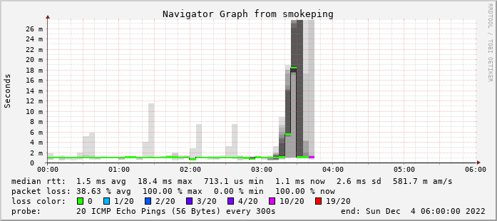

# 2022-12-04から2022-12-06にかけてmstdn.aoirint.comで発生していた障害について

2023-02-10: タイトル・文言の修正

2022-12-04 03:40頃から、mstdn.aoirint.comで障害が発生していました。

- 2022-12-04 03:40頃 障害発生（WAN側IPアドレスの変更）
- 2022-12-06 15:00頃 障害を認識、原因を特定、DNSレコードを変更
- 2022-12-06 15:10頃 TTL経過により解消の見込み

## サービスの死活監視

サービスの死活監視は、内部ネットワークのSmokePing、および外部ネットワークのBetter Uptimeを使用しています。

以下の画像は、2022-12-04 00:00から06:00における、SmokePingによるNATループバックPingの監視記録です。
これ以降、SmokePingの宛先IPアドレス変更が行われるまで、不通の状態が続きました。

現在のサーバ環境では、原因を特定できていない短時間の接続不良が毎日のように発生しており、
今回の障害ではBetter Uptimeの停止通知が一時的なものでないことに気づかないまま、48時間以上経過することになりました。

今後の対応について、DDNSサービスやCloudflare等を活用したサーバ環境の安定化対策を検討しています。
