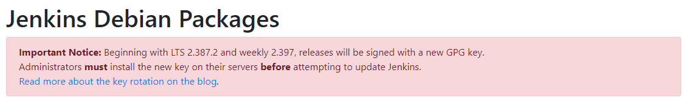

# Jenkinsのapt GPGキーを更新する

```plain
$ sudo apt update

Err:9 https://pkg.jenkins.io/debian-stable binary/ Release.gpg
  The following signatures couldn't be verified because the public key is not available: NO_PUBKEY 5BA31D57EF5975CA

W: An error occurred during the signature verification. The repository is not updated and the previous index files will be used. GPG error: https://pkg.jenkins.io/debian-stable binary/ Release: The following signatures couldn't be verified because the public key is not available: NO_PUBKEY 5BA31D57EF5975CA
W: Failed to fetch https://pkg.jenkins.io/debian-stable/binary/Release.gpg  The following signatures couldn't be verified because the public key is not available: NO_PUBKEY 5BA31D57EF5975CA
W: Some index files failed to download. They have been ignored, or old ones used instead.
```



- [https://pkg.jenkins.io/debian-stable](https://pkg.jenkins.io/debian-stable)

```shell
curl -fsSL https://pkg.jenkins.io/debian-stable/jenkins.io-2023.key | sudo tee /usr/share/keyrings/jenkins-keyring.asc > /dev/null
```
