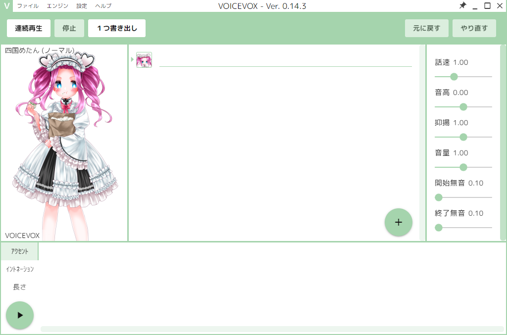
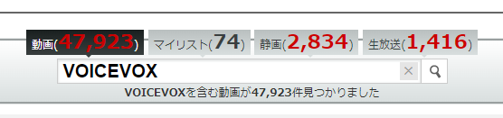
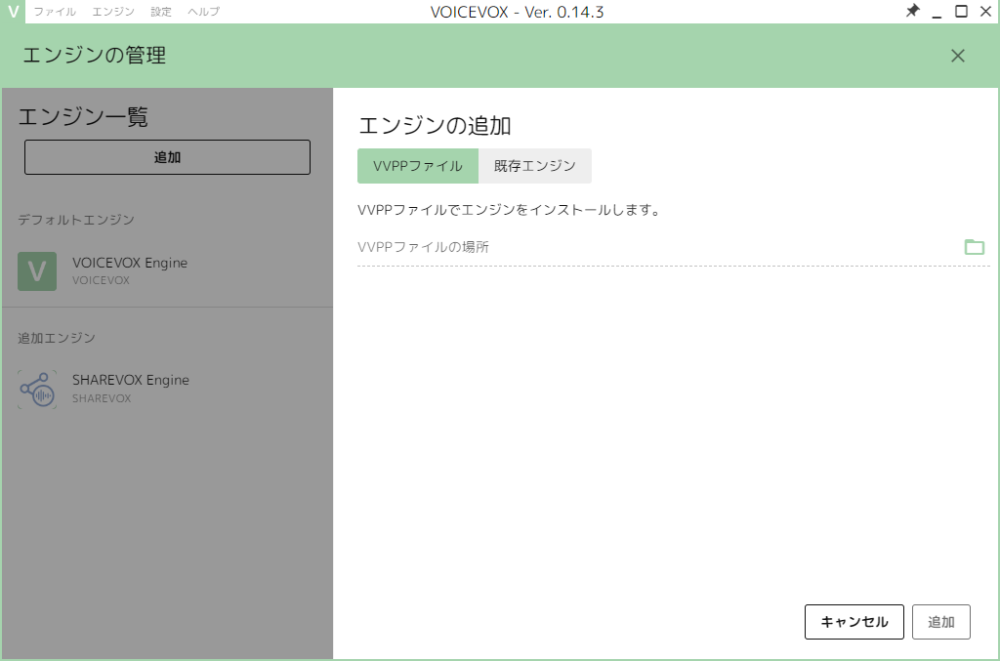

# 「VOICEVOX OSS 放送 第2回」に出演しました

VOICEVOXプロジェクトオーナーのヒホさんにお声がけいただいて、
VOICEVOXの新機能であるマルチエンジン機能をユーザと開発者に紹介する趣旨で、2023年2月4日（土）の生放送に開発者ゲストとして出演しました。アーカイブは、ニコニコ動画のプレミアム会員であれば、2月11日（土） 23:59まで視聴できます。

- [【VOICEVOX OSS 放送 第２回】マルチエンジン実装 - 2023/2/4(土) 21:00開始 - ニコニコ生放送](https://live.nicovideo.jp/watch/lv340125951)

<blockquote class="twitter-tweet">
📢VOICEVOX OSS 放送の告知 📢 2月4日(土)の21時から、VOICEVOXのマルチエンジン機能を、メインで実装してくださったおふたりをゲストに招いてご紹介する放送をします！ VOICEVOXのコントリビューターの方はもちろん、VOICEVOXのOSS活動にご興味ある方もぜひお越しください！<a href="https://t.co/hlNU6cWoXi">https://t.co/hlNU6cWoXi</a>
&mdash; ヒホ（ヒロシバ）🗑️ (@hiho_karuta) <a href="https://twitter.com/hiho_karuta/status/1620382357344911360?ref_src=twsrc%5Etfw">January 31, 2023</a></blockquote>

## VOICEVOXとは

VOICEVOX（ボイスボックス）は、ヒホ氏が2021年8月にリリースした無料の音声合成ソフトで、キャラクターの要素を含まない部分がOSS化されており、現在GitHub上でオープンに開発が行われています。
用途としては主に、ニコニコ動画やYouTubeなどの動画投稿サイトで、ゲーム実況やキャラクター劇場、解説などの読み上げ音声として使われています。2023年2月9日 1:31時点で、ニコニコ動画上には関連する動画が48000件ほど投稿されています。

- [VOICEVOX | 無料のテキスト読み上げソフトウェア](https://voicevox.hiroshiba.jp/)

- [キーワードで動画検索 VOICEVOX - ニコニコ動画](https://www.nicovideo.jp/search/VOICEVOX)

## 経緯

VOICEVOXには、2021年9月から個人でコントリビュートしており、2021年12月からレビュワーをしています。これまで、主に以下のような貢献をしています。

- GitHub Actionsによる自動ビルドパイプラインの構築
- Linux対応
- Docker対応
- マルチエンジン機能の設計

## マルチエンジン機能とは

VOICEVOXは、主にエディタ・エンジン・コアの3つのコンポーネントからなっています（詳細はGitHub上の[全体構成](https://github.com/VOICEVOX/voicevox/blob/a22046c731dbd88794a0e2e0d0a632b977bf5e29/docs/%E5%85%A8%E4%BD%93%E6%A7%8B%E6%88%90.md)を参照）。
ソースコードが公開されていることから、VOICEVOXと互換性のあるAPIを持ち、VOICEVOXのUIを再利用した音声合成ソフト（ボイボ系ソフト）がいくつかリリースされています。

- [COEIROINK（コエイロインク）](https://coeiroink.com/): [シロワニさん](https://twitter.com/shirowanisan)
- [LMROID（レミロイド）](https://lmroidsoftware.wixsite.com/nhoshio): [のほしお](https://twitter.com/ssohsn)さん
- [SHAREVOX（シェアボックス）](https://www.sharevox.app/): [Yちゃん](https://twitter.com/y_chan_dev)
- [ITVOICE（イタボイス）](https://itahobi.booth.pm/items/4374126): [いたほび](https://twitter.com/itahobi)さん

<blockquote class="twitter-tweet">
🎉 マルチエンジン機能が実装されました！  これまでボイボ系ソフトは、複数のキャラクター音声を生成するために複数のソフトを起動する必要がありました。 マルチエンジン機能により、VOICEVOX API に準拠している別々のエンジンのキャラクターが、１つのソフトに集まれるようになりました。 <a href="https://t.co/ZN0rgkYAX8">pic.twitter.com/ZN0rgkYAX8</a>
&mdash; VOICEVOX (@voicevox_pj) <a href="https://twitter.com/voicevox_pj/status/1620376485025685505?ref_src=twsrc%5Etfw">January 31, 2023</a></blockquote>

今回のマルチエンジン機能は、ボイボ系ソフトのエディタが、これまで自身のブランドのエンジンにしか接続できなかったものを、異なるボイボ系ソフトのエンジンにも接続できるようにするものです。上のリリース告知ツイートに添付された画像による図解を見ると、イメージしやすいです。

マルチエンジン機能の実装には1年ほどかかりましたが、2021年12月ごろから仕様の検討やエディタの内部APIの改修を進めており、その後、UIの主要な変更やエンジン側のAPIの検討・実装を主に[名無し。](https://github.com/sevenc-nanashi)さんや[takana-v](https://github.com/takana-v)さんが進めてくださり、リリースにこぎ着けました。

## 最後に

マルチエンジン機能は、ネットワーク経由のエンジン接続や、バージョンの異なるエンジンへの接続など、まだまだ発展性のある機能だと思います。

もし、VOICEVOXへのOSS貢献に興味のある開発者がこれを読んでいるのであれば、ぜひVOICEVOXに貢献してみませんか？　例えば、Issueを覗くと、あなたの技術で簡単に修正できるものがあるかもしれません。

- [Issues · VOICEVOX/voicevox](https://github.com/VOICEVOX/voicevox/issues)
- [Issues · VOICEVOX/voicevox_engine](https://github.com/VOICEVOX/voicevox_engine/issues)
- [Issues · VOICEVOX/voicevox_core](https://github.com/VOICEVOX/voicevox_core/issues)

わたしはいち開発者にすぎませんが、音声合成の世界・音声合成の作る世界が好きです。そのさらなる発展を願っています。

## 勝手に宣伝

記事の内容とは直接関係ありませんが、個人的に、勝手に宣伝をさせてください。

VOICEVOXに搭載された複数のキャラクターの権利者である東北ずん子プロジェクトさんが2023年1月17日から2023年2月13日まで、「東北きりたん」というキャラクターの音声合成ソフトに関するクラウドファンディングを行っているようです（「東北きりたん」の誕生日は、2月13日です）。2023年2月9日 2:42現在、第10ゴールを達成し、2233人の支援者と、36,576,800円の支援が集まっているようです。また、「東北イタコ」や「東北ずん子」、VOICEVOX「中国うさぎ」「ずんだもん」にもリターンが拡大しています。同好の士が集う音声合成キャラクターの世界では、クラウドファンディングは新しいことを実現する大きな力になります。

<blockquote class="twitter-tweet">
東北きりたんのVOICEPEAK化クラウドファンディング、ぜひ支援してください((o(*´∀`*)o))<a href="https://t.co/cpA4SovRuS">https://t.co/cpA4SovRuS</a> <a href="https://t.co/DI6zOCKdk7">pic.twitter.com/DI6zOCKdk7</a>
&mdash; 東北ずん子💚きりたんボイスピ クラウドファンディング (@t_zunko) <a href="https://twitter.com/t_zunko/status/1615318033387651073?ref_src=twsrc%5Etfw">January 17, 2023</a></blockquote>

- [東北きりたん、東北イタコの新しい音声合成voicepeak化 | SSSファンド](https://greenfunding.jp/pub/projects/6932)

また、東北ずん子プロジェクトさんのアニメ「ずんだホライずん」がYouTube・ニコニコ動画で2022年12月30日から2023年2月15日までの期間限定で無料公開されています。2023年2月9日 2:56現在、YouTubeでは638,355回視聴、2,162件コメントされているようです（ニコニコ動画は今回の無料公開以前からの合算のため割愛）。2017年のアニメですが、その後VOICEVOXに搭載されたキャラクター「四国めたん」「ずんだもん」「九州そら」も出演しています。また、搭載予定のキャラクター「中国うさぎ」も出演しています。24分間、視聴するとずん子ワールドが味わえます。

- [ずんだホライずん【無料公開2/15まで】 - YouTube](https://www.youtube.com/watch?v=DjGhj1wUBd4)
- [ずんだホライずん - ニコニコ動画](https://www.nicovideo.jp/watch/so32568633)
- [アニメ ずんだホライずん](https://zunko.jp/con_ani.html)（公式サイト）

2023-02-10追記: クラウドファンディングの第11ゴールが発表されました。「ずんだホライずん」のテレビ再放送のようです（2022年12月30日にもTOKYO MXで放送していました）。

<blockquote class="twitter-tweet">
第11ゴールは、ずんだホライずんのTV放送です((o(*´∀`*)o))<a href="https://t.co/cpA4SovRuS">https://t.co/cpA4SovRuS</a> <a href="https://t.co/ehcm37k7M1">pic.twitter.com/ehcm37k7M1</a>
&mdash; 東北ずん子💚きりたんボイスピ クラウドファンディング (@t_zunko) <a href="https://twitter.com/t_zunko/status/1623660520594354176?ref_src=twsrc%5Etfw">February 9, 2023</a></blockquote>

<iframe src="https://greenfunding.jp/pub/projects/6932/widget?format=landscape&type=3" width="600px" height="255px" frameborder="0"></iframe>
