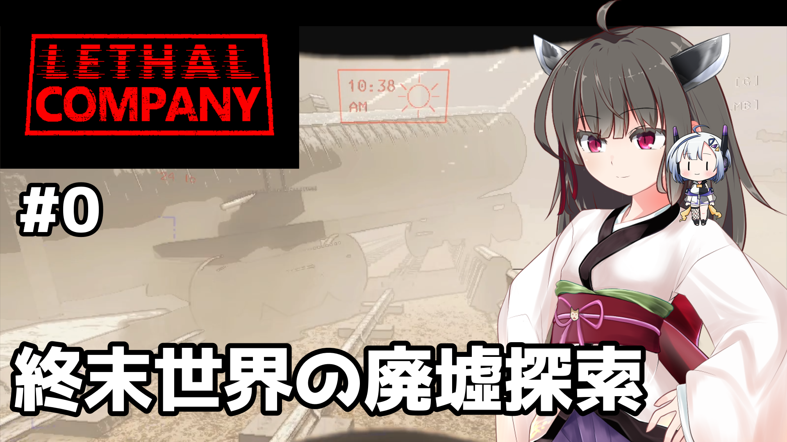
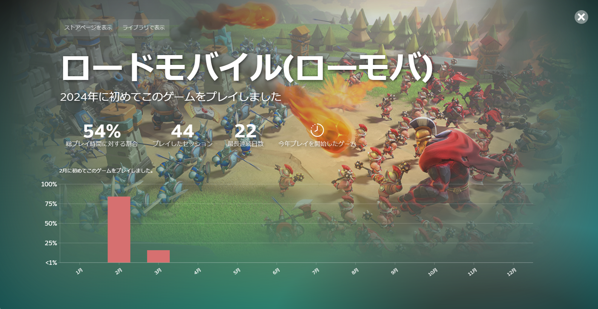
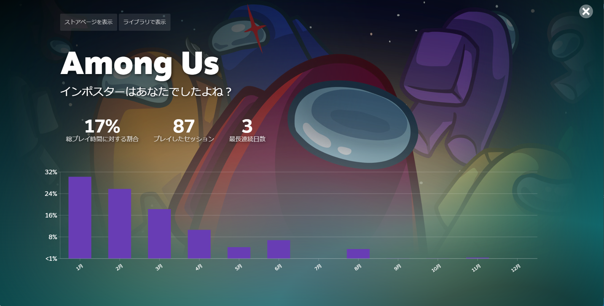
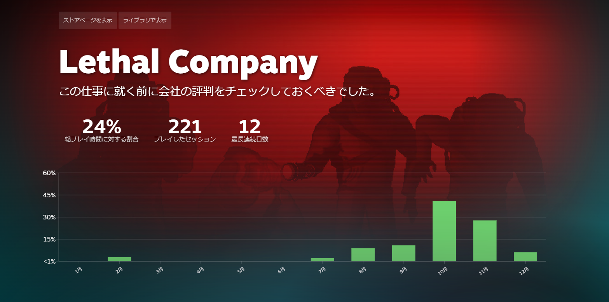

# 2024年の総括

## 動画投稿・配信

Minecraft Moddingのときに使っていた「かのみや」名義で動画投稿・配信をしています。

1月にシルシランド関連のコミュニティで参加したAmong Usのコミュニティ内向けの動画を投稿していました。

- [【ずんだもんうぉーず】闇鍋ジャッカル全滅R〒A #2【Among Us／Extreme Roles】 - ニコニコ動画](https://www.nicovideo.jp/watch/sm43323152)

実はこの動画自体は8月くらいにいったん編集が終わっていて、なにか方針に悩んで寝かせていたんですが、
悩んでいたことを忘れて、再編集して投稿しました。

それから、2月の東北きりたん生誕祭2024に向けて、ゲームLethal Companyの実況動画「きりたんのガラクタ拾い」を計画していて、
2023年末に収録していたもので進めていましたが、
遊劇場になりきらない実況動画という方針を打ち立てたことが自分の技量を超えていて、編集に納得がいかずボツになっています。

すでにきりたんを起用したLethal Companyの実況動画が出ていますし、のちに「小夜のガラクタ拾い」を投稿したので、これにて供養ということになるかと思います。

きりたんの立ち絵はぴぴさん、No.7の立ち絵はぼいばけ公式より。

同時期に双葉湊音を起用した「双葉湊音のガラクタ拾い」も計画していて、こちらは2024年初頭にはやりたいことに対してプレイヤースキルが足りなかったんですが、いまならあともう1つ2つというところかなと思っています。
これが出るかどうかは、ネタの収集が進むかどうかにかかっていそうですが、「小夜のガラクタ拾い」でネタのチラ見せはしたので、それで満足しちゃうかもしれません。

11月・12月には、Lethal Companyの実況動画「小夜のガラクタ拾い」を投稿しました。

Lethal Companyの動画は、生声の配信・ショートクリップ、あるいはソフトウェアトークの解説というのが主流で、
ソフトウェアトークの実況は流行っていないというのが実情だと思いますが、
小夜さんがちょうど自分の需要に応えてくれたので、ショートクリップを基本としたソロプレイの実況動画という形になっています。
続くかどうかは、ネタが集まるかどうかによります。

## ゲーム

Steamリプレイ2024によると、今年は「ロードモバイル」、「Lethal Company」、「Among Us」を一番遊んでいたらしいです。

ロードモバイルはいろいろなVtuber・配信者にリスナー参加型のイベント案件を持ちかけていて、
ニコニコのコミュニティ「なのそん」のイベントにリスナーとして参加していました。
開いたまま放置できるゲームなのでプレイ時間がかさんでいる感じですが、短期間集中のイベントということもあり、
時間とお金を使うほど有利になるゲームでもあります。

ゲームの仕様上、8-12時間に1回くらいは触れる必要があるようになっていて、
頻繁に触れないと不利になるということも考慮して、イベント終了後は撤退しました。

Among Usはシルシランド関連のコミュニティで参加する機会がありますが、半年くらい参加できてないです。
生活習慣が変わって、休日の夜早い時間に眠くなることが多くなったこともあると思いますが、
グループで交流ができる貴重な機会なので、来年は一考したいです。

Lethal Companyはマルチプレイ推奨のゲームではあるんですが、2月以外はソロプレイの練習をしていました。
命が軽いゲームなので、1ミスでゲームオーバーになるソロプレイは厳しく、ほとんど敗退してリセットになるんですが、たまにうまくハマるので、スリルを楽しめるゲームになっています。
12月は、9月から11月にかけての継続プレイでプレイヤースキルが一定になったのと、動画素材の収集が中心でプレイ時間が少ないです。
動画ネタの準備も絡めて、まだまだプレイヤースキルを上げられるところはあるので、来年も引き続き楽しみたいゲームではあります。

## エンジニアリング

尻切れトンボなんですが、エンジニアリングについて語れることがあまり多くありません。

今年から、7年ほどお世話になっていた時給制のアルバイト職を離れることになり、月給制のフルタイムエンジニアに転職あるいは就職しました。
業務に貢献しつつ、自分なりに少しずつエンジニアリング環境を整えている、といったところです。

OSS活動の方は、ようやく12月になって差し迫ったタスクを進めたといったところで、あまり時間をかけられていないのが苦しいところではあります。
タスクを背負うということは、それに手間と時間をかける責任が生じるということで、来年は一考していきたいと思うところです。

流行りといまになって言えるのか怪しいかもしれませんが、LLMについては11月頃になってようやくエンジニアリングに取り入れる習慣が芽生えてきて、生産性の向上に繋げていきたいと思っています。

## 生活習慣

生活習慣については、フルタイム職ということもあって比較的マシにはなっていると思います。

2023年の夏からスマートウォッチを導入したので、睡眠時間や運動時間の計測ができるようになり、自分の生活習慣を客観的に見ることができるようになりました。

今年度の初め頃は、業務のために睡眠習慣・生活習慣を安定させるという目的で、朝・昼・夕などに意識的に短時間運動するようにしていたんですが、
夏になって暑くなってからは、起床時間も遅くなり、運動習慣はほとんどなくなりました。

現在も運動はまれにという範囲にとどまっており、1日のほとんどを座って過ごす生活を続けています。
考えようによっては、スマートウォッチ効果は1年を経過して慣れに変わり、薄れているのかもしれません。

入眠時間が遅くなることが多くなっているのも気になるところです。
これは個人的によくない兆候で、義務にせよ目標にせよ、1度起床に失敗すると、その後すべてのスケジュールとタスクが狂って、メンタルに悪影響を及ぼします。

来年は意識的に時間を使う習慣を身に着けて、現在のスケジュールに合った生産性の高い生活習慣を確立・維持することを目標としたいと思っています。
動画編集や開発をしている間は、比較的そういう動きができていたのかなと思うので、時間を作ってもやりたいことを見つける、というのが本当の目標になるのかもしれません。
